# 无人值守 Linux 安装镜像制作

## 实验要求

- [x] 定制一个普通用户名和默认密码
- [x] 定制安装 OpenSSH Server
- [x] 安装过程禁止自动联网更新软件包

## 实验环境

### AC-Server

- 镜像：`ubuntu-18.04.4-server-amd64.iso`
- 网卡：NAT 网络 + Host-Only
- Host-Only IP：192.168.56.13/24

### AC-Kali

- 镜像：`kali-linux-2019.3-amd64.iso`
- 网卡：NAT 网络 + Host-Only
- Host-Only IP：192.168.56.3/24
- 用途：SSH 跳板机

## 实验过程

### 网络配置

- 本次实验 Host-Only 网卡是在安装完成后添加的（在安装前添加也是可以的）
- 在配置前，Host-Only 网络所对应的网卡尚未获取到 IP 地址<br>
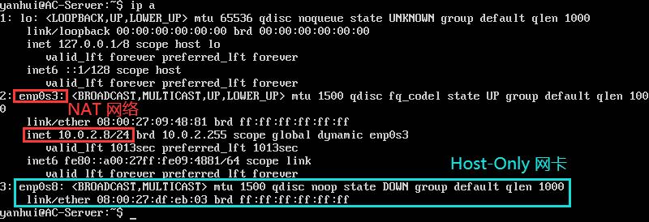
- 编辑`/etc/netplan/01-netcfg.yaml`（注意缩进）
    ```bash
    network:
        version: 2
        renderer: networkd
        ethernets:
            enp0s3:
                dhcp4: yes
                dhcp6: yes
            enp0s8:
                dhcp4: yes
                dhcp6: yes
                # DHCP 获取 IP 地址时使用的标识为 MAC 地址
                dhcp-identifier: mac
    ```
- `sudo netplan apply`使网卡配置生效
- 配置生效后， Host-Only 网络所对应的网卡成功获取到了 IP 地址<br>
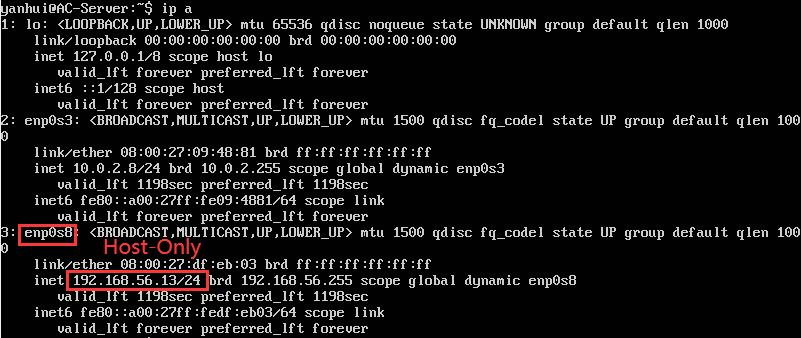

### 配置 SSH 免密登录

- Windows 宿主机可通过`ssh yanhui@192.168.56.13`连接 AC-Server，但每次连接都需要输入密码
- 在未进行远程连接的情况下，宿主机命令行窗口（使用 WSL）输入以下命令：
    ```bash
    # 创建创建公钥-私钥对，已有密钥可以跳过
    ssh-keygen

    # 将宿主机的公钥复制到 AC-Server
    ssh-copy-id -i ~/.ssh/id_rsa.pub yanhui@192.168.56.13
    ```
- 之后连接 AC-Server 就不再需要输入密码了<br>
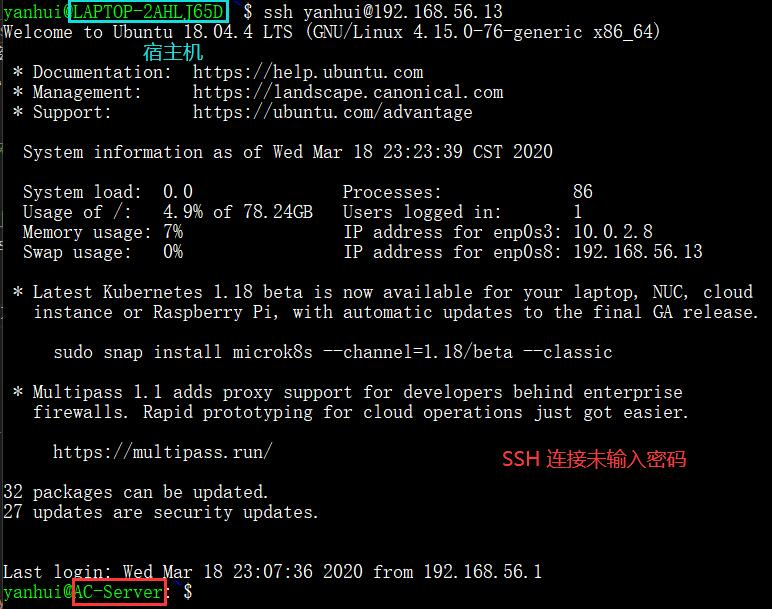
- PS：如果连接不上，需要修改目标主机`/etc/ssh/sshd_config`文件哦 :)
  - 值得注意的修改项：PermitRootLogin, PubkeyAuthentication

### 定制镜像

```bash
# 在当前用户目录下创建一个用于挂载iso镜像文件的目录
mkdir loopdir

# 将宿主机iso镜像文件上传
# Windows 10 WSL
# scp local_file remote_username@remote_ip:remote_folder
scp ubuntu-18.04.4-server-amd64.iso yanhui@192.168.56.13:~

# 挂载iso镜像文件到 loopdir
# -o loop 把文件当成硬盘分区挂载到目录
mount -o loop ubuntu-18.04.4-server-amd64.iso loopdir

# 创建一个工作目录用于克隆光盘内容
mkdir cd

# 同步光盘内容到目标工作目录
# 注意 loopdir 后面有 /, cd 后面不能有 /
rsync -av loopdir/ cd
# rsync: remote (and local) file-copying tool
# -a, --archive 归档模式，表示以递归方式传输文件，并保持所有文件属性
# -v, --verbose 输出详细信息

# 卸载iso镜像
umount loopdir

# 进入目标工作目录
cd cd/

# 编辑 Ubuntu 安装引导界面增加一个新菜单项入口
sudo vi isolinux/txt.cfg

# 添加以下内容后强制保存并退出
# 强制保存 :w!
label autoinstall
  menu label ^Auto Install Ubuntu Server
  kernel /install/vmlinuz
  append  file=/cdrom/preseed/ubuntu-server-autoinstall.seed debian-installer/locale=en_US console-setup/layoutcode=us keyboard-configuration/layoutcode=us console-setup/ask_detect=false localechooser/translation/warn-light=true localechooser/translation/warn-severe=true initrd=/install/initrd.gz root=/dev/ram rw quiet

# 修改配置缩短超时等待时间
sudo vi isolinux/isolinux.cfg

# 修改内容
timeout 10
```
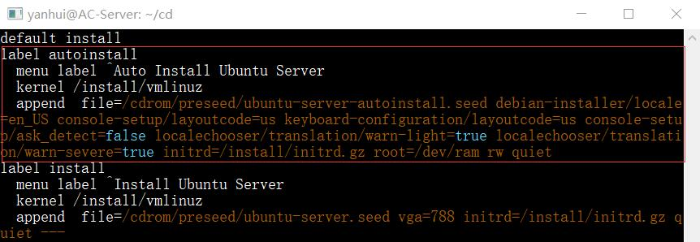<br>
阅读并编辑定制 Ubuntu 官方提供的示例 [preseed.cfg](https://help.ubuntu.com/lts/installation-guide/example-preseed.txt)，并将该文件内容保存到刚才创建的工作目录`~/cd/preseed/ubuntu-server-autoinstall.seed`（使用 SSH 连接可以直接复制粘贴 XD）
  - 另一种方法是以已装好的主机为模板生成`preseed.cfg`
    ```bash
    apt install debconf-utils
    debconf-get-selections --installer > file
    debconf-get-selections >> file
    ```
  - 但这种方法生成的文件会包含一些不应该出现的语句，使用提供的示例文件进行修改会更好，仅可以用来查看配置（下图为使用`debconf-get-selections`生成的文件节选）<br>
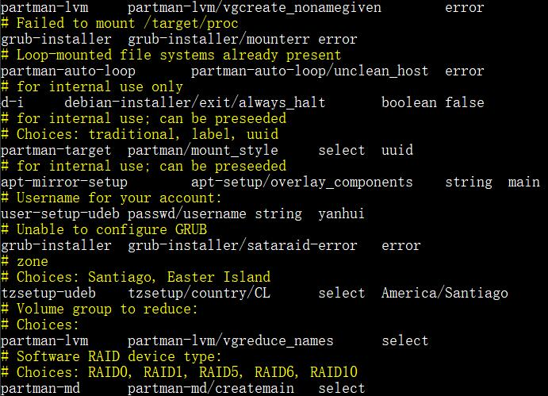<br>
  - 使用`debconf-set-selections -c preseed.cfg`命令查看文件格式是否有效。
```bash
# 重新生成md5sum.txt
cd ~/cd && find . -type f -print0 | xargs -0 md5sum > md5sum.txt

# Command 'mkisofs' not found
apt install genisoimage

# 封闭改动后的目录到.iso
IMAGE=custom.iso
BUILD=~/cd/

mkisofs -r -V "Custom Ubuntu Install CD" \
            -cache-inodes \
            -J -l -b isolinux/isolinux.bin \
            -c isolinux/boot.cat -no-emul-boot \
            -boot-load-size 4 -boot-info-table \
            -o $IMAGE $BUILD
# 执行完成后工作目录下会生成一个 custom.iso 镜像文件
```

### 无人值守安装

将生成的镜像文件拷贝到本地
```bash
# 拷贝到当前文件夹
# Windows 10 WSL
scp yanhui@192.168.56.13:~/cd/custom.iso .
```
整个安装过程持续约 10 分钟，视频长度约 1 分钟。[点击查看视频](https://pan.baidu.com/s/1NRk1aBFq6DEKG5QX3aSzcg)<br>


输入预先设定的用户名和密码即可进入<br>
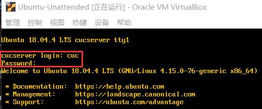<br>
安装完毕后配置的网络即生效，并且可以上网<br>
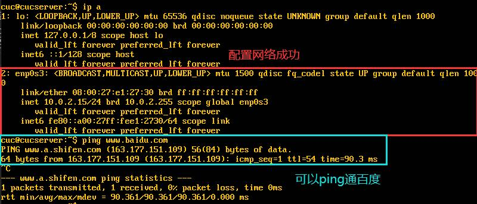

### 分析比较

- 使用在线的文本比较工具就能很轻松的进行比对，这里附上比对结果：https://www.diffchecker.com/efZ7XlZO
- 在 SHELL 中可以使用`vimdiff`进行文本差异比对：`vimdiff left_file right_file`

  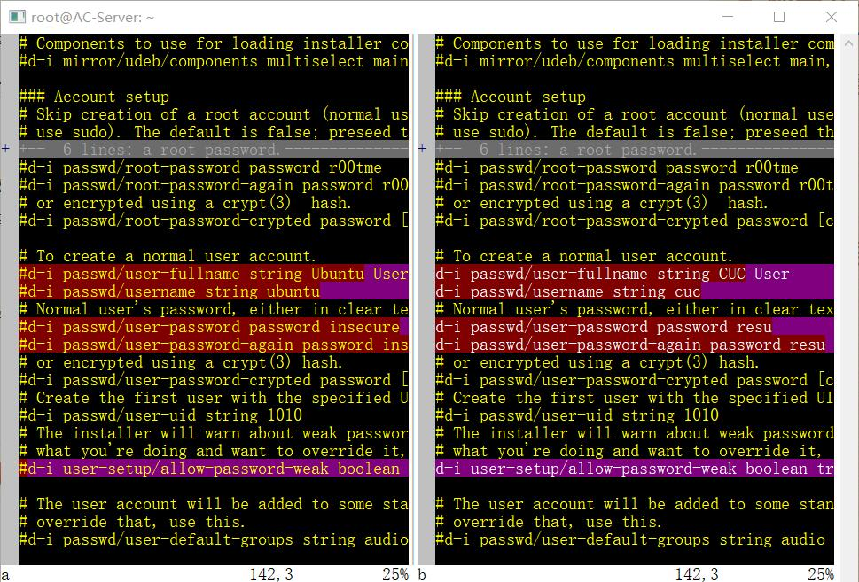<br>
  - 在两个文本间切换使用`(ctrl + W) + W`
  - 可以很方便的将差异句统一为某一个文本的内容，使用`dp`（把当前文件内容推到对面文件）或`do`（把对面文件内容拉到当前文件）命令


- 主要改动及意义

修改前 | 修改后 | 意义 / 作用
-|-|-
stretch|bionic|[18.04 "Bionic"series](https://launchpad.net/ubuntu/bionic)
`#d-i debian-installer/language string en`<br>`#d-i debian-installer/country string NL`<br>`#d-i debian-installer/locale string en_GB.UTF-8`<br>`#d-i localechooser/supported-locales multiselect en_US.UTF-8, nl_NL.UTF-8`|`d-i debian-installer/language string en`<br>`d-i debian-installer/country string CN`<br>`d-i debian-installer/locale string en_US.UTF-8`<br>`d-i localechooser/supported-locales multiselect en_US.UTF-8,zh_CN.UTF-8`| 选择国家地区语言
`#d-i netcfg/link_wait_timeout string 10`|`d-i netcfg/link_wait_timeout string 1`|将链路检测等待超时时间缩短为1秒（默认为3秒）
`#d-i netcfg/dhcp_timeout string 60`|`d-i netcfg/dhcp_timeout string 5`|将等待DHCP服务器超时时间缩短为5秒
`#d-i netcfg/disable_autoconfig boolean true`|`d-i netcfg/disable_autoconfig boolean true`|手动配置网络（配置文件`# IPv4 example`下紧跟网络设置，包括 IP 地址、网关、域名解析服务器，虚拟机网卡：NAT 网络）
`d-i netcfg/get_hostname string unassigned-hostname`<br>`d-i netcfg/get_domain string unassigned-domain`|`d-i netcfg/get_hostname string CUC-Server`<br>`d-i netcfg/get_domain string cuc.edu.cn`|设置主机名和域名（从 DHCP 分配的任何主机名和域名都优先于此处设置的值）
`#d-i netcfg/hostname string somehost`|`d-i netcfg/hostname string cucserver`|强制设置主机名为`cucserver`
`#d-i passwd/user-fullname string Ubuntu User`<br>`#d-i passwd/username string ubuntu`<br>`#d-i passwd/user-password password insecure`<br>`#d-i passwd/user-password-again password insecure`<br>`#d-i user-setup/allow-password-weak boolean true`|`d-i passwd/user-fullname string CUC User`<br>`d-i passwd/username string cuc`<br>`d-i passwd/user-password password resu`<br>`d-i passwd/user-password-again password resu`<br>`d-i user-setup/allow-password-weak boolean true`|创建普通用户，设置用户名及密码并确认为弱密钥
`#d-i partman-auto/init_automatically_partition select biggest_free`|`d-i partman-auto/init_automatically_partition select biggest_free`|如果系统具有可用空间，则可以选择仅对该空间进行分区
`#d-i partman-auto-lvm/guided_size string max`|`d-i partman-auto-lvm/guided_size string max`|LVM 分区方式，设置逻辑卷的大小为最大
`d-i partman-auto/choose_recipe select atomic`|`d-i partman-auto/choose_recipe select multi`|分区方式：`multi: separate /home, /var, and /tmp partitions`
`#d-i apt-setup/use_mirror boolean false`|`d-i apt-setup/use_mirror boolean false`|禁用网络镜像
`tasksel tasksel/first multiselect ubuntu-desktop`|`tasksel tasksel/first multiselect server`|选择安装 server 软件包
`#d-i pkgsel/include string openssh-server build-essential`|`d-i pkgsel/include string openssh-server`|安装 OpenSSH Server
`#d-i pkgsel/upgrade select none`|`d-i pkgsel/upgrade select none`|安装完成后禁止自动升级包
`#d-i pkgsel/update-policy select none`|`d-i pkgsel/update-policy select unattended-upgrades`|自动安装安全类更新

### SSH 跳板登录

- SSH 跳板登录示意图<br>
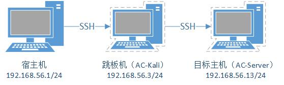
- 跳板机和目标主机均需要存有宿主机的公钥
- 使用`ssh -J root@192.168.56.3 yanhui@192.168.56.13`命令就可以一步通过跳板机直接到目标主机了 XD
  > -J [user@]host[:port] Connect to the target host by first making a ssh connection to the pjump host[(/iam/jump-host) and then establishing a TCP forwarding to the ultimate destination from there.
- 目标主机打开防火墙，防止宿主机『一步登天』
  ```bash
  # 只允许来自跳板机的 SSH 连接
  iptables -A INPUT -p tcp -s 192.168.56.3 --dport 22 -j ACCEPT
  iptables -A INPUT -p tcp -s 0.0.0.0/0 --dport 22 -j DROP
  ```
  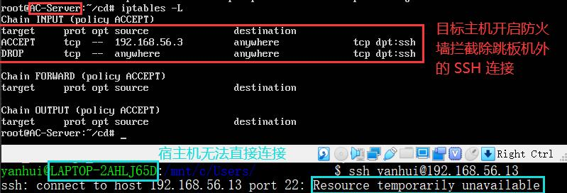
- 通过跳板机，宿主机成功连接上目标主机<br>

  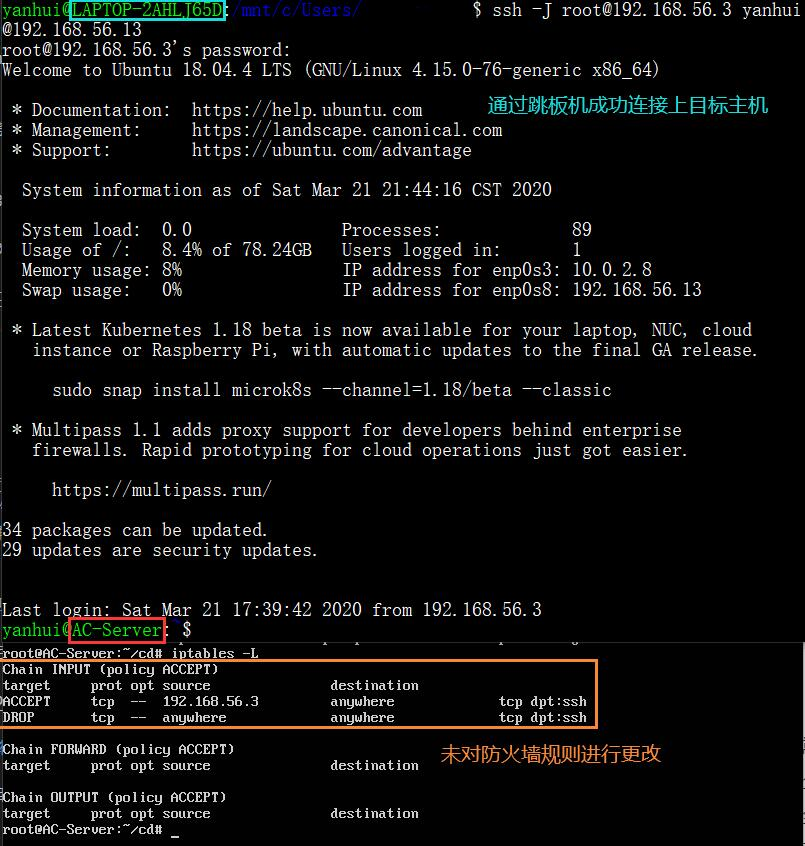
- 如果跳板机挂掉了，连接会中断噢 XD<br>
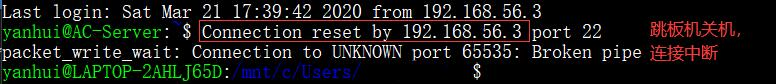

## 其它问题

### SCP vs SFTP

- `scp`和`sftp`都是可以传输文件的命令，非常相似
- `scp`在具有高延时的网络传输文件的速度比`sftp`快
- `scp`和`sftp`均基于 SSH，并提供相同的安全功能
- `sftp`除实现了安全传输文件的功能，还有查看/搜索目录、创建/组织文件、删除或重命名文件等功能，`scp`仅安全的传输文件这一项功能
- `scp`和`sftp`都没有传输文件大小的限制，但`scp`传输速度可能受到文件大小的影响
- 实际使用哪个命令，可根据具体需求来决定
- 参考：[SCP or SFTP: Which is Better?](https://www.cerberusftp.com/comparing-scp-vs-sftp-which-is-better/)

### vim 粘贴，遇到注释不自动添加注释和缩进

在粘贴前先设置进入粘贴插入模式，即不会自动缩进和连续注释
```bash
:set paste
```

## 参考资料

- [Ssh-copy-id for copying SSH keys to servers - SSH.com](https://www.ssh.com/ssh/copy-id)
- [mount(8): mount filesystem - Linux man page](https://linux.die.net/man/8/mount)
- [Appendix B. Automating the installation using preseeding](https://help.ubuntu.com/lts/installation-guide/amd64/apb.html)
- [can't ssh into remote host with root, password incorrect](https://unix.stackexchange.com/questions/79449/cant-ssh-into-remote-host-with-root-password-incorrect)
- [SSH Command](https://www.ssh.com/ssh/command)