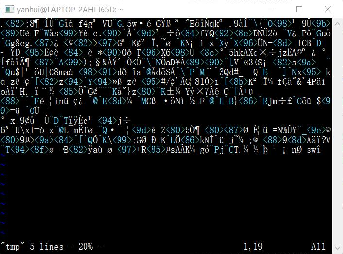

# Linux 命令行使用基础

## 实验要求

- [x] vimtutor 操作全程录像
- [x] 描述环境
- [x] 目录下文本查找

## 实验环境

### AC-Server

- 镜像：`ubuntu-18.04.4-server-amd64.iso`
- 网卡：NAT 网络 + Host-Only

### LAPTOP-2AHLJ65D

- Windows 10 WSL

### asciinema

```bash
# install
sudo apt install asciinema

# Link install ID with asciinema.org user account
asciinema auth
```

## 操作录像

### Vimtutor - Lesson 1

<a href="https://asciinema.org/a/k04nNLTKZIn1OJPvovIy8AVlr" target="_blank"></a>

### Vimtutor - Lesson 2

<a href="https://asciinema.org/a/iLTl9Y48AgBKUZO3X84naKsPM" target="_blank"></a>

### Vimtutor - Lesson 3

<a href="https://asciinema.org/a/AShdqFi03OmSZjIQlYQJlkzmb" target="_blank"></a>

### Vimtutor - Lesson 4

<a href="https://asciinema.org/a/PHwLIgvcQ8xkRkWgUsgOXM0jr" target="_blank"></a>

### Vimtutor - Lesson 5

<a href="https://asciinema.org/a/ieRw9PSvEZWLshaUJPiuFOb2S" target="_blank"></a>

### Vimtutor - Lesson 6

<a href="https://asciinema.org/a/XCs00td9xHvSMuKnGh0ZsXw1S" target="_blank"></a>

### Vimtutor - Lesson 7

<a href="https://asciinema.org/a/IMgN2u3L4opFhRvGiTwFE63Ac" target="_blank"></a>

## 自查清单

### Vim 有哪几种工作模式？

Normal 模式、Insert 模式、Visual 模式、Replace 模式、Command-line 模式、Select 模式、Ex 模式

### Normal 模式下，从当前行开始，一次向下移动光标 10 行的操作方法？如何快速移动到文件开始行和结束行？如何快速跳转到文件中的第 N 行？

- 一次向下移动光标 10 行：`10j`
- 快速移动到文件开始行：`gg`
- 快速移动到文件结束行：`G`
- 快速跳转到文件中的第 N 行：`NG`/`Ngg`

### Normal 模式下，如何删除单个字符、单个单词、从当前光标位置一直删除到行尾、单行、当前行开始向下数 N 行？

- 删除单个字符：光标移动到要删除的字符，键入`x`
- 删除单个单词：`dw`或`de`（两者有所不同）
  ```bash
  There are a cats.

  # 使用 dw 删除
  There are cats.

  # 使用 de 删除，cats 前的空格没有删除
  There are  cats.
  ```
- 从当前光标位置一直删除到行尾：`d$`
- 删除单行：`dd`
- 删除当前行开始向下数 N 行：`Ndd`

### 如何在 vim 中快速插入 N 个空行？如何在 vim 中快速输入 80 个 - ？

- 快速插入 N 个空行：`NO`+`Esc`（在光标上方插入）/`No`+`Esc`（在光标下方插入）
- 快速输入 80 个 -：Normal 模式下，`80i-`/`80a-`/`80A-`+`ESC`

### 如何撤销最近一次编辑操作？如何重做最近一次被撤销的操作？

- 撤销最近一次编辑操作：`u`
- 重做最近一次被撤销的操作：`CTRL-R`

### vim 中如何实现剪切粘贴单个字符？单个单词？单行？如何实现相似的复制粘贴操作呢？

- 剪切
  - 单个字符：`x`/`dl`
  - 单个单词：`dw`
  - 单行：`dd`
- 复制
  - 单个字符：`yl`
  - 单个单词：`yw`
  - 单行：`yy`
- 粘贴：`p`（在光标之后）/`P`（在光标之前）

### 为了编辑一段文本你能想到哪几种操作方式（按键序列）？

- 插入：`i/a/A`
- 修改：`r`、`R`、`c`、`:s/old/new`
- 删除：`x`、`d`
- 粘贴：`p/P`

### 查看当前正在编辑的文件名的方法？查看当前光标所在行的行号的方法？

使用`CTRL-G`可以查看当前正在编辑的文件名和当前光标所在行的行号。

### 在文件中进行关键词搜索你会哪些方法？如何设置忽略大小写的情况下进行匹配搜索？如何将匹配的搜索结果进行高亮显示？如何对匹配到的关键词进行批量替换？

- 进行关键词搜索：`/pattern`
- 设置忽略大小写：`:set ic`
  - 单次搜索忽略大小写使用：`/pattern\c`
- 将匹配的搜索结果进行高亮显示：`:set hls`
- 将`a`批量替换为`b`：`:%s/a/b/g`

### 在文件中最近编辑过的位置来回快速跳转的方法？

在 Normal 模式下使用`CTRL-O`（向后）和`CTRL-I`（向前）。

### 如何把光标定位到各种括号的匹配项？例如：找到(, [, or {对应匹配的),], or }

光标先移动到一对括号的其中一个，按下`%`后，光标会移动到其对应匹配的括号。

### 在不退出 vim 的情况下执行一个外部程序的方法？

Normal 模式下，输入`:!`，其后跟随需要执行的外部程序的指令。

### 如何使用 vim 的内置帮助系统来查询一个内置默认快捷键的使用方法？如何在两个不同的分屏窗口中移动光标？

- 使用 vim 的内置帮助系统查询一个内置默认快捷键的使用方法（如`w`）：在 Normal 模式下，输入`:help w`
- 有些快捷键在不同工作模式下作用不同
  - `:help <Shortcut>` 查询 Normal 模式下的快捷键
  - `:help i_<Shortcut>` 查询 Insert 模式下的快捷键
  - `:help c_<Shortcut>` 查询 Command-line 模式下的快捷键
  - `:help v_<Shortcut>` 查询 Visual 模式下的快捷键
- 在两个不同的分屏窗口中移动光标：`CTRL-W CTRL-W`

## 描述环境

### 软件相关

- 操作系统发行版和内核信息
  - `lsb_release -a` / `cat /etc/*-release` 查看发行版本
  - `uname -a` 查看内核信息
- 系统中当前有谁在线（非本地）
  - `w`/`who`
- 现在在运行的进程有哪些
  - `pstree`/`ps aux`
- 哪些进程在监听哪些端口
  ```bash
  netstat -ltpn
  # -l display listening server sockets
  # -t List listening TCP ports
  # -p Display PID and program names
  # -n don't resolve names

  lsof
  ```
- 挂载点和文件系统
  - `mount`
  - `hier`
- 已安装应用软件列表、故障或问题发生前最近新安装的软件信息
  - 已安装应用软件列表：`dpkg -l`
  - `/var/log/dpkg.log`
- 系统环境变量、当前用户环境变量
  - 系统环境变量：`/etc/environment`
  - 当前用户环境变量：`env` / `printenv`
- 故障/问题发生前后邻近的系统日志、应用程序日志等
  - `/var/log/`
- 系统自启动项有哪些，自启动机制分别是什么；系统定时任务有哪些，触发机制分别是什么
  - `systemctl list-unit-files --type=service`
    - static / enabled / disabled / masked
  - `ls /etc/cron*`
- 出问题应用程序的当前环境变量设置情况等
  - `env` / `printenv`
- 当前系统中哪些应用程序/进程在占用网络带宽？
  - `top`

### 网络相关

- 系统的 IP 地址、MAC 地址信息
  - `ip a`
- ARP 表 / 路由表 / hosts 文件配置 / DNS 服务器配置
  - `ip neigh` / `ip route` / `/etc/hosts` / `/etc/resolv.conf`
- 防火墙规则表
  - `iptables`

### 硬件相关

- 获得硬件信息：`report-hw`

## 常用 Linux 命令

### 软件包管理

```bash
# 源列表
/etc/apt/sources.list
```

#### 更新

```bash
# 使用源列表中定义的镜像源地址更新本地可用软件包信息数据库
# 并不会安装或更新任何软件
apt update

# 根据本地的可用软件包信息数据库文件内容更新安装当前系统中所有已安装软件的版本
# 不会删除软件包
apt upgrade

# 更新已安装软件并解决依赖问题
# 可能会删除软件包
apt dist-upgrade

# 对 apt-get 进行封装的一个更友好、更易用（主要体现在自动解决软件依赖 bug 上）包管理工具
aptitude  # 需安装
```

#### 查找与信息查看

```bash
# 查看软件包本地版本以及远程镜像仓库版本（是否 apt update 可能会影响）
apt policy packagename

# 查找应用程序所在的软件包
apt-cache search appname
# e.g. apt-cache search mkisofs

# 查看该软件包依赖哪些独立软件包
apt-cache depends packageanme

# 查看软件包的详细信息
apt show packagename

# 列举与软件包相关的文件
dpkg -L packagename
```

#### 删除

```bash
# 删除已安装软件包但不删除配置文件
apt remove

# 删除已安装软件包和配置文件
apt purge

# 删除 /var/cache/apt/archives/ 和 /var/cache/apt/archives/partial/
# 目录下除了 lock 文件之外的所有已下载（软件包）文件
apt clean
```

### 文件管理

#### 查看

```bash
# 查看当前工作目录
pwd

# 查看隐藏文件（文件名以 . 开头）
ls -a

# 列举文件并显示详细信息
ls -l

# 显示文件属性，如大小，所属用户，修改时间等
stat filename
```

#### 修改

```bash
# 创建一个新文件或将已存在文件的时间修改为当前时间
touch filename

# 将文件时间修改为一个特定的日期和时间
touch -t {{YYYYMMDDHHMM.SS}} filename

# 使用文件 1 的时间来设置文件 2 的时间
touch -r filename1 filename2

# Access：最后一次访问文件的时间（不一定会更新，频繁更新会导致磁盘 I/O 下降等问题）
# Modify：最后一次修改文件的时间
# Change：最后一次修改文件属性的时间
```
touch 使用示例：<br>


```bash
# 删除文件
rm filename

# 覆盖一个文件，安全处理
shred filename
```
`shred`前：<br>
<br>
`shred`后：<br>


#### 其他

```bash
# 创建软链接
ln -s {{path/to/file_or_directory}} {{path/to/symlink}}

# 将已有软链接指向另一个文件
ln -sf {{path/to/new_file}} {{path/to/symlink}}

# 创建硬链接
ln {{path/to/file}} {{path/to/hardlink}}

# 根据扩展名查找文件
find {{root_path}} -name '{{*.ext}}'

# 找到匹配后执行命令
# 每个文件执行一条命令使用 {}
find {{root_path}} -name '{{*.ext}}' -exec {{command {}}} \;
```

### 文本处理

```bash
# 不断读取并显示文件最后的部分，直到 CTRL-C
tail -F {{file}}

# 显示文件的开头部分
head

# 以冒号作为分隔符，分割并输出第 1,6 列
cut -d ":" -f 1,6

# 大小写转换
echo "hello world" | tr [:lower:] [:upper:]

# 删除指定字符
echo "hello world" | tr -d h

# 字母替换
echo "hello world" | tr o a

# 行数统计
wc -l

# 词数统计
wc -w

# 字节数、字符数统计
wc -c
```

- 查找并统计某函数在整个“项目”（以 [Syntax-Analysis](https://github.com/YanhuiJessica/Syntax-Analysis) 为例）中被调用次数，并输出在哪些文件、具体哪些行中调用到了该函数
  - 被调用次数：
    ```bash
    find Syntax-Analysis/ -name "*.py" | xargs grep "setStart" | grep -v "def" | wc -l
    # 3
    ```
  - 在哪些文件、具体哪些行：
    ```bash
    find Syntax-Analysis/ -name "*.py" | xargs grep -n "setStart" | grep -v "def"
    # Syntax-Analysis/LR.py:48:        self.setStart('S\'')
    # Syntax-Analysis/LR.py:107:        self.dfa.setStart(0)
    # Syntax-Analysis/LR.py:430:        self.dfa.setStart(0)
    ```
- 在整个目录中查找某关键词出现在哪些文件的哪些行
  ```bash
  find Syntax-Analysis/ -name "*.py" | xargs grep -n "setStart"
  # Syntax-Analysis/FiniteAutomata.py:18:    def setStart(self, state):
  # Syntax-Analysis/LR.py:19:    def setStart(self, startsy):
  # Syntax-Analysis/LR.py:48:        self.setStart('S\'')
  # Syntax-Analysis/LR.py:107:        self.dfa.setStart(0)
  # Syntax-Analysis/LR.py:430:        self.dfa.setStart(0)
  ```
- 删除C语言编写项目中的所有注释行（单行）：`grep -v "^//" {{infile}} > {{outfile}}`

### 文件压缩与解压缩

```bash
# 处理文件解压乱码
# -O 指定编码方案
unzip -O cp936 test.zip
```

### 进程管理

```bash
# 查看当前所有进程
ps aux

# 查看进程树
pstree

# 查看进程 PID
pidof

# 类似于 tasklist
top

# 改进的交互式系统信息查看器
htop

# 杀进程
kill # 发送终止信号
kill -9 # 发送强制终止信号
kill -s N # 发送指定信号
killall <process_imagename>

& # 将进程放到后台执行

fg # 将最近挂起的后台作业置于前台
bg # 恢复最近挂起的作业并在后台运行它

Ctrl + C # 终止进程
Ctrl + Z # 挂起进程
```

#### 多窗口

```bash
tmux # 开启一个新的窗口

# 将当前窗口放入后台运行
Ctrl+B d
# 删除当前会话
Ctrl+D
# 或
exit

# 查看当前所有 tmux 会话
tmux ls

tmux attach-session # 接入最近使用的会话
tmux attach-session -t {{name}} # 接入某个特定的会话

# 杀掉某个特定会话
tmux kill-session -t {{name}}
```


### 目录管理

```bash
mkdir # 创建目录
mkdir -p # 递归创建目录

rm -rf # 删除目录
rmdir # 删除空目录

/proc # 进程信息相关的伪文件系统
```

### 网络调试

```bash
# 查看 ARP 地址表
ip neigh show

# 查看路由表
ip route
```

### 其他

```bash
# 查看当前操作终端用户的身份以及所属群组
id

# 查看当前 Ubuntu 系统发行版本
lsb_release -a

# 升级系统版本
do-release-upgrade

# 查看当前 shell 环境中已定义的别名有哪些
alias

# sudo 只能对可执行程序提升权限，不能对 bash 的内置函数操作
# 可使用的检查方式
type
command -v
```

#### su, sudo and bash

- `su`（Switch User）用于切换到另一个用户，甚至可以不使用参数切换到 root 用户。使用`su`切换用户需要输入要切换到的用户的密码
- 使用`sudo`可以以 root 权限执行一条命令，但与`su`不同的是`sudo`需要当前用户的密码
  - 输入密码后，系统会保留 15 分钟，并不需要每次都输入密码
- `bash`是与计算机交互的文本界面
  - 登录 shell：以指定的用户身份登录，需要用户名和密码
  - 非登录 shell：在不登录的情况下可以使用的 shell，这是当前登录用户所必需的
  - 交互式 shell 和非交互式 shell
- `sudo su -`
  - `-`也可写作`-l`或`--login`，模拟一个完整的登录 shell，`~/.profile`和`~/.bashrc`都会执行<br>

  - 使用`sudo su -`切换到 root 用户后，目录变为 root 用户的 home 目录<br>

- `sudo su`，bash 将作为交互式非登录 shell，此时只执行`~/.bashrc`<br>

  - 使用`sudo su`切换到 root 用户后，当前目录不会发生变化<br>

- `sudo bash`，以 root 权限执行命令`bash`。`/bin/bash`作为非登录 shell 启动，所有隐藏文件都不执行，但 bash 本身要读取调用用户的`.bashrc`
  - 使用`sudo bash`切换到 root 用户后，环境不会发生变化，身份为 root 用户，但是家目录仍是原用户<br>


## 参考资料

- [linux-2019-jckling - 0x02](https://github.com/CUCCS/linux-2019-jckling/tree/master/0x02)
- [Asciinema - Getting started](https://asciinema.org/docs/getting-started)
- [Vim documentation: intro](http://vimdoc.sourceforge.net/htmldoc/intro.html#vim-modes-intro)
- [Repeating characters in VIM insert mode](https://stackoverflow.com/questions/5054128/repeating-characters-in-vim-insert-mode)
- [System-wide environment variables](https://help.ubuntu.com/community/EnvironmentVariables#System-wide_environment_variables)
- [How to tell the difference between apt-get upgrade, apt-get dist-upgrade, and do-release-upgrade](https://www.techrepublic.com/article/how-to-tell-the-difference-between-apt-get-upgrade-apt-get-dist-upgrade-and-do-release-upgrade/)
- ['sudo su -' vs 'sudo -i' vs 'sudo /bin/bash' - when does it matter which is used, or does it matter at all?](https://askubuntu.com/questions/376199/sudo-su-vs-sudo-i-vs-sudo-bin-bash-when-does-it-matter-which-is-used)