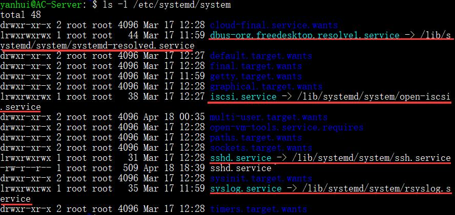
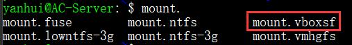
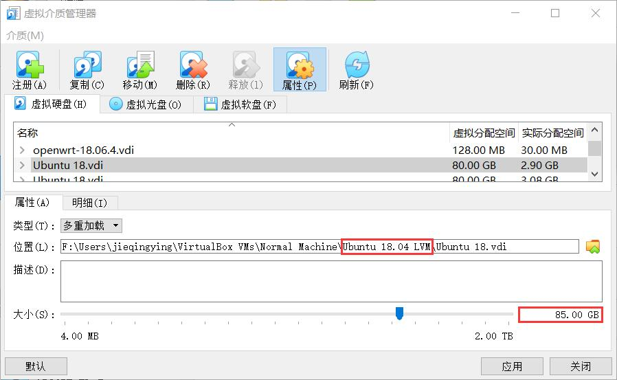
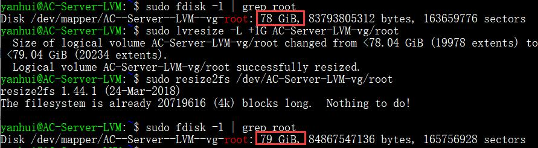
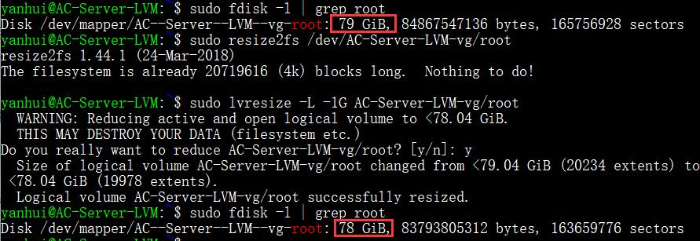
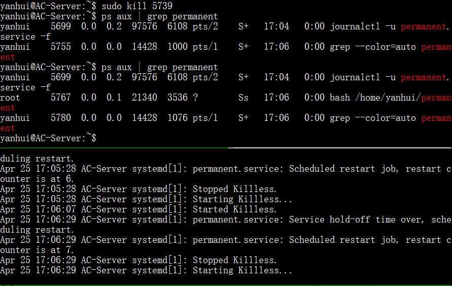

# Systemd 入门

## 实验要求

- [x] 实验操作全程录像
- [x] 按清单自查

## 实验环境

### AC-Server

- 网卡：NAT 网络 + Host-Only
- Host-Only IP：192.168.56.13

### Database-Manager

- Host-Only IP：192.168.56.17
- 网卡：NAT 网络 + Host-Only
- 用于远程 Unit 状态被查看

### AC-Server-LVM

- 用于 LVM 实验

## 实验过程

### Systemd 概述与系统管理

- 查看 Systemd 的版本：`systemctl --version`
- Systemd 是一组命令，涉及系统管理的各方面
- `systemctl`是 Systemd 的主命令，用于管理系统
  ```bash
  # 挂起系统：系统当前运行时状态数据保存到内存，此时仍有电量消耗，唤醒速度快
  sudo systemctl suspend

  # 让系统进入休眠状态：系统当前运行时状态数据保存到硬盘，此时完全没有电量消耗
  # 唤醒速度相比 suspend 稍慢
  sudo systemctl hibernate

  # 同时执行休眠和挂起，仍有电量消耗，当电量耗尽后，再次开机执行 hibernate 恢复操作
  sudo systemctl hybrid-sleep
  ```
- `systemd-analyze`用于查看启动耗时
  ```bash
  # 查看启动耗时
  systemd-analyze

  # 查看每个服务的启动耗时
  systemd-analyze blame

  # 显示瀑布状的启动过程流
  systemd-analyze critical-chain

  # 显示指定服务的启动流
  systemd-analyze critical-chain <servicename>.service
  ```
- `hostnamectl`用于查看当前主机的信息
  ```bash
  # 显示当前主机的信息
  hostnamectl

  # 设置主机名
  sudo hostnamectl set-hostname <hostname>
  # 使用 bash 可以立即生效
  ```
- `localectl`用于查看本地化设置
  ```bash
  # 查看本地化设置
  localectl

  # 列出所有可用的本地化参数，帮助正确使用 set-locale
  localectl list-locales

  # 设置本地化参数
  sudo localectl set-locale LANG=en_GB.utf8
  sudo localectl set-keymap en_GB   # 键盘映射
  ```
- `timedatectl`用于查看当前时区设置
  ```bash
  # 查看当前时区设置
  timedatectl

  # 显示所有可用的时区
  timedatectl list-timezones

  # 设置当前时区
  sudo timedatectl set-timezone America/New_York
  sudo timedatectl set-time YYYY-MM-DD
  sudo timedatectl set-time HH:MM:SS
  ```
- `loginctl`用于查看当前登录的用户
  ```bash
  # 列出当前 session
  loginctl list-sessions

  # 列出当前登录用户
  loginctl list-users

  # 显示指定的会话状态，默认当前调用者的会话
  loginctl session-status [SID]

  # 列出显示指定用户的信息
  loginctl show-user yanhui
  ```
- 操作录像<br>

  <a href="https://asciinema.org/a/CMngN0xF4EVZMw8TK3ZGKsDy6" target="_blank"></a>

### Unit

- Systemd 可以管理所有系统资源，不同的资源统称为 Unit（单位），一共分为 12 种
- Systemd 默认后缀名为`.service`
- 查看不同状态的 Unit
  ```bash
  # 列出正在运行的 Unit
  systemctl list-units

  # 列出所有 Unit，包括没有找到配置文件的或者启动失败的
  systemctl list-units --all

  # 列出所有没有运行的 Unit
  systemctl list-units --all --state=inactive

  # 列出所有加载失败的 Unit
  systemctl list-units --failed

  # 列出所有正在运行的、类型为 service 的 Unit
  systemctl list-units --type=service

   # 列出所有为系统挂载点的 Unit
  systemctl list-unit-files --type=mount
  ```
- 查看系统状态和单个 Unit 的状态
  ```bash
  # 显示系统状态
  systemctl status

  # 显示单个 Unit 的状态
  sysystemctl status <servicename>.service

  # 显示远程主机的某个 Unit 的状态
  systemctl -H yanhui@192.168.56.17 status <servicename>.service
  ```
- 查询状态的简单方法，主要供脚本内部的判断语句使用
  ```bash
  # 显示某个 Unit 是否正在运行
  systemctl is-active <servicename>.service

  # 显示某个 Unit 是否处于启动失败状态
  systemctl is-failed <servicename>.service

  # 显示某个 Unit 服务是否建立了启动链接
  systemctl is-enabled <servicename>.service
  ```
- Unit 管理
  ```bash
  # 立即启动一个服务
  sudo systemctl start <servicename>.service

  # 立即停止一个服务
  sudo systemctl stop <servicename>.service

  # 重启一个服务
  sudo systemctl restart <servicename>.service

  # 杀死一个服务的所有子进程
  sudo systemctl kill <servicename>.service

  # 重新加载一个服务的配置文件
  sudo systemctl reload <servicename>.service

  # 重载所有修改过的配置文件
  sudo systemctl daemon-reload

  # 显示某个 Unit 的所有底层参数
  systemctl show <servicename>.service

  # 显示某个 Unit 的指定属性的值
  systemctl show -p GuessMainPID sshd.service

  # 设置某个 Unit 的指定属性
  sudo systemctl set-property apache2.service CPUShares=600
  # 需要注意的是并不是所有属性都可以在运行时设置
  # 也可以通过修改配置文件来设置属性
  # sudo vi /etc/systemd/system/sshd.service
  # sudo systemctl daemon-reload
  # 重启后修改生效
  ```
- 依赖关系
  ```bash
  # 列出一个 Unit 的所有依赖
  systemctl list-dependencies <servicename>.service
  ```
- 操作录像<br>

  <a href="https://asciinema.org/a/LxGG5y1tBKY3HV97qUDm7pbdY" target="_blank"></a>

### Unit 的配置文件

- Systemd 默认从`/etc/systemd/system/`读取配置文件，但目录里存放的大部分文件都是符号链接，指向目录`/lib/systemd/system/`<br>

  
- `systemctl enable`用于在`/etc/systemd/system/`和`/lib/systemd/system/`两个目录之间，建立符号链接关系。如果配置文件里面设置了开机启动，`systemctl enable`相当于激活开机启动
  ```bash
  sudo systemctl enable apache2.service
  # 等同于
  sudo ln -s '/lib/systemd/system/apache2.service' '/etc/systemd/system/multi-user.target.wants/apache2.service'
  ```
- `systemctl disable`用于撤销两个目录间的符号链接关系，相当于撤销开机启动：`sudo systemctl disable <servicename>.service`
- `systemctl list-unit-files`用于列出所有配置文件
  ```bash
  # 列出所有配置文件
  systemctl list-unit-files

  # 列出指定类型的配置文件
  systemctl list-unit-files --type=service
  ```
- 使用`systemctl cat <servicename>.service`查看配置文件的内容（大小写敏感）
- 操作录像<br>

  <a href="https://asciinema.org/a/p4Kj1R7IhD0rjP3OhRfOXlr4Y" target="_blank"></a>

### Target

- Target 是一个 Unit 组，启动某个 Target 的时候，Systemd 就会启动里面所有的 Unit
  ```bash
  # 查看当前系统的所有 Target
  systemctl list-unit-files --type=target

  # 查看一个 Target 包含的所有 Unit
  systemctl list-dependencies <targetname>.target

  # 查看启动时的默认 Target
  systemctl get-default

  # 设置启动时的默认 Target
  sudo systemctl set-default <targetname>.target

  # 切换 Target 时，默认不关闭前一个 Target 启动的进程，
  # 使用 systemctl isolate 改变这种行为
  # 关闭前一个 Target 里面所有不属于后一个 Target 的进程
  sudo systemctl isolate multi-user.target
  ```
- 操作录像<br>

  <a href="https://asciinema.org/a/6GCGUPUWHu1tHAyXXnyxLc4zR" target="_blank"></a>

### 日志管理

- Systemd 统一管理所有 Unit 的启动日志，日志配置文件是`/etc/systemd/journald.conf`
  ```bash
  # 查看所有日志（默认情况下 ，只保存本次启动的日志，重启后丢掉以前的日志）
  journalctl

  # 查看内核日志（不显示应用日志）
  journalctl -k

  # 查看系统本次启动的日志
  journalctl -b [-0]

  # 查看 journalctl 已知的系统启动日志
  journalctl --list-boots

  # 查看某次启动的日志
  journalctl -b -n

  # 查看指定时间的日志
  journalctl --since

  # 显示尾部指定行数的日志（默认 10 行）
  journalctl -n [N]

  # 实时滚动显示最新日志
  journalctl -f

  # 使用特定可执行程序展示信息
  journalctl /lib/systemd/systemd
  journalctl /bin/bash

  # 查看指定进程的日志
  journalctl _PID=1

  # 查看指定用户的日志
  journalctl _UID=<uid> --since today

  # 查看某个 Unit 的日志
  journalctl -u <unit>
  journalctl -u <unit> --since today

  # 实时滚动显示某个 Unit 的最新日志
  journalctl -u <unit> -f

  # 合并显示多个 Unit 的日志
  journalctl -u <unit1> -u <unit2> --since today

  # 查看指定优先级（及其以上级别）的日志，共有8级
  # 0 - 4: emerg alert crit err
  # 5 - 8: warning notice info debug
  journalctl -p err -b

  # 日志默认分页输出，--no-pager 改为正常的标准输出
  journalctl --no-pager

  # 以 JSON 格式（单行）输出
  journalctl -b -u <unit> -o json

  # 以 JSON 格式（多行）输出
  journalctl -b -u <unit> -o json-pretty

  # 显示日志占据的硬盘空间
  journalctl --disk-usage

  # 减少日志到指定大小以下
  sudo journalctl --vacuum-size=1G

  # 删除早于指定的日志
  sudo journalctl --vacuum-time=1years
  ```
- 操作录像<br>

  <a href="https://asciinema.org/a/AwCB0SzgJUTnHwNYqX40Buanw" target="_blank"></a>

## 自查清单

### 如何添加一个用户并使其具备 sudo 执行程序的权限？

- 使用`adduser`添加一个用户：`sudo adduser <username>`
- 将用户添加至`sudo`组：`sudo adduser <username> sudo`

### 如何将一个用户添加到一个用户组？

`sudo adduser <username> <groupname>`

### 如何查看当前系统的分区表和文件系统详细信息？

- 查看分区表：`sudo fdisk -l`或`sudo sfdisk -l`或`sudo cfdisk`或`parted print`
- 查看文件系统详细信息：`df -a`
- `lsblk -f -p`同时查看分区表和文件系统详细信息

### 如何实现开机自动挂载 Virtualbox 的共享目录分区？

- 安装增强工具：`sudo apt install virtualbox-guest-utils`
  - 安装完成后会新增 mount.vboxsf 命令，说明目前已经可以挂载共享目录了

- Virtualbox 的共享文件夹设置为：自动挂载 和 固定分配
- 创建一个挂载用文件夹：`sudo mkdir /mnt/tmp`
- `sudo vi /etc/systemd/system/mnt-tmp.mount`
  - 这里 automount 文件命名必须和文件中定义的挂载点路径满足以下严格要求
  - > Mount units must be named after the mount point directories they control. Example: the mount point /home/lennart must be configured in a unit file home-lennart.mount.
  ```bash
  # /etc/systemd/system/mnt-tmp.mount
  [Unit]
  Description=vbox shared dir mount script
  Requires=network-online.target
  After=network-online.service

  [Mount]
  # 这里的 tmpvbox 是在 Virtualbox 共享文件夹设置里指定的 共享文件夹名称
  What=tmpvbox

  # 这里的 /mnt/tmp 是挂载目的目录，如果没有，需要事先创建好
  Where=/mnt/tmp

  # 指定挂载文件系统类型
  Type=vboxsf

  [Install]
  WantedBy = multi-user.target
  ```
- 查看 Unit 是否添加成功：`sudo systemctl list-unit-files | grep mnt-tmp.mount`
- 创建到`/etc/systemd/system/multi-user.target.wants`目录下的软链接：`sudo systemctl enable mnt-tmp.mount`
- 创建一个自动挂载类型的 Unit 文件：`/etc/systemd/system/mnt-tmp.automount`
  ```bash
  # /etc/systemd/system/mnt-tmp.automount
  [Unit]
  Description=vbox shared dir mount script
  Requires=network-online.target
  After=network-online.service

  [Automount]
  Where=/mnt/tmp
  TimeoutIdleSec=10

  [Install]
  WantedBy = multi-user.target
  ```
- 执行`sudo systemctl enable mnt-tmp.automount`命令
- 重启系统后生效

### 基于 LVM（逻辑分卷管理）的分区如何实现动态扩容和缩减容量？

- 确保已经安装了`lvm2`
- 在关机的情况下，将虚拟硬盘的大小扩充到 85 G（原 80 G）

- 查看逻辑卷信息：`sudo lvdisplay`
- 增大分区`/dev/sda1`的容量后，需要执行`sudo pvresize /dev/sda1`来扩展物理卷的大小，命令将自动探测设备当前大小并将物理卷扩展到其最大容量（但`pvresize`不会改变物理卷的大小直到分区更新）
- 先将`AC-Server-LVM-vg`组中的`root`逻辑卷扩大 1 G，后调整文件系统
  ```bash
  sudo lvresize -L +1G AC-Server-LVM-vg/root
  sudo resize2fs /dev/AC-Server-LVM-vg/root
  ```
  
- 先调整文件系统，后将`AC-Server-LVM-vg`组中的`root`逻辑卷缩小 1 G
  ```bash
  sudo resize2fs /dev/AC-Server-LVM-vg/root
  sudo lvresize -L -1G AC-Server-LVM-vg/root
  ```
  
- 在缩小物理卷所在设备大小之前，需要通过指定`--setphysicalvolumesize`参数缩小物理卷大小
  ```bash
  sudo pvresize --setphysicalvolumesize 80G /dev/sda1
  ```

### 如何通过 systemd 设置实现在网络连通时运行一个指定脚本，在网络断开时运行另一个脚本？

- tmux 水平分割当前窗格：`Ctrl-b "`
  - 窗格间跳转：`Ctrl-b 方向键`
- 网络连通性相关
  ```bash
  # 查看网络连接状态
  networkctl

  # 断开网络
  sudo ip link set enp0s3 down

  # 连接网络
  sudo ip link set enp0s3 up

  # 使用 netplan 检验
  sudo netplan apply
  ```
- 脚本文件编写，文件在`/usr/lib/networkd-dispatcher`目录下
  - 各状态的解释来源：[networkctl - Query the status of network links](https://manpages.debian.org/unstable/systemd/networkctl.1.en.html)
  - `dormant.d/demo.sh`
    ```bash
    #!/usr/bin/env bash
    # the device has a carrier, but is not yet ready for normal traffic
    # IFACE - interface that triggered the event
    echo "$(date) $IFACE is dormant" >> /tmp/demo.log
    ```
  - `no-carrier.d/demo.sh`
    ```bash
    #!/usr/bin/env bash
    # the device is powered up, but it does not yet have a carrier

    echo "$(date) $IFACE has no carrier" >> /tmp/demo.log
    ```
  - `off.d/demo.sh`
    ```bash
    #!/usr/bin/env bash
    # the device is powered down

    echo "$(date) $IFACE is off" >> /tmp/demo.log
    ```
  - `routable.d/demo.sh`
    ```bash
    #!/usr/bin/env bash
    # the link has carrier and routable address configured

    echo "$(date) $IFACE is routeable" >> /tmp/demo.log
    ```
  - shebang 一定要在文件开头：[OSError: [Errno 8] Exec format error](https://stackoverflow.com/questions/27606653/oserror-errno-8-exec-format-error)
- 使用`sudo chmod +x <filename>`为上述脚本文件添加可执行权限
- `networkd-dispatcher`服务需要是 active 状态才会执行脚本：`systemctl start networkd-dispatcher.service`
- 操作录像：<br>

  <a href="https://asciinema.org/a/7gjRizNm3GAEaI0doV4g6xfhf" target="_blank"></a>
- 参考：https://asciinema.org/a/ND40x8WroOoDwjP2BWiR3ojLI

### 如何通过 systemd 设置实现一个脚本在任何情况下被杀死之后会立即重新启动？实现杀不死？

- 编写一个脚本文件`permanent`并赋予可执行权限
  ```bash
  #!/usr/bin/env bash
  sleep 60s
  ```
- 使用`sudo vi /etc/systemd/system/permanent.service`创建并编辑配置文件，内容如下
  ```bash
  [Unit]
  Description=Killless

  [Service]
  Type=forking
  ExecStart=/home/yanhui/permanent
  Restart=always
  RestartSec=1s

  [Install]
  WantedBy=multi-user.target
  ```
- 重新加载配置文件`sudo systemctl daemon-reload`，并启动服务`systemctl start permanent`
- 自动重启效果如下：<br>

  
- 参考：[systemd.unit — Unit configuration](https://www.freedesktop.org/software/systemd/man/systemd.unit.html)

## 实验总结

- shebang 的位置真的很重要(╥ω╥)

## 参考资料

- [Systemd 入门教程：命令篇 by 阮一峰的网络日志](http://www.ruanyifeng.com/blog/2016/03/systemd-tutorial-commands.html)
- [Systemd 入门教程：实战篇 by 阮一峰的网络日志](http://www.ruanyifeng.com/blog/2016/03/systemd-tutorial-part-two.html)
- [CGroup configuration in CentOS 7 - Stack Overflow](https://stackoverflow.com/questions/47367886/cgroup-configuration-in-centos-7)
- [2.3. Modifying Control Groups - Red Hat Customer Portal](https://access.redhat.com/documentation/en-us/red_hat_enterprise_linux/7/html/resource_management_guide/sec-modifying_control_groups)
- [systemd/Journal](https://wiki.archlinux.org/index.php/Systemd/Journal)
- [How to mount a VirtualBox shared folder at startup?](https://askubuntu.com/questions/252853/how-to-mount-a-virtualbox-shared-folder-at-startup)
- [Systemd: (Auto-) Mount cifs shares](https://michlstechblog.info/blog/systemd-mount-examples-for-cifs-shares/)
- [LVM (简体中文)](https://wiki.archlinux.org/index.php/LVM_(%E7%AE%80%E4%BD%93%E4%B8%AD%E6%96%87))
