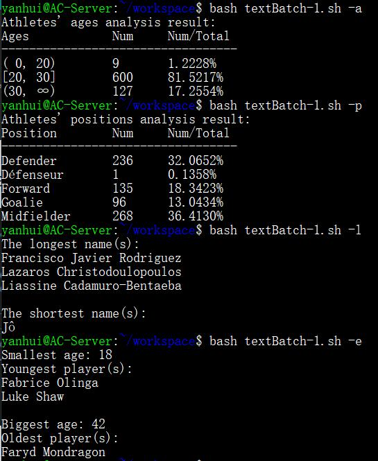
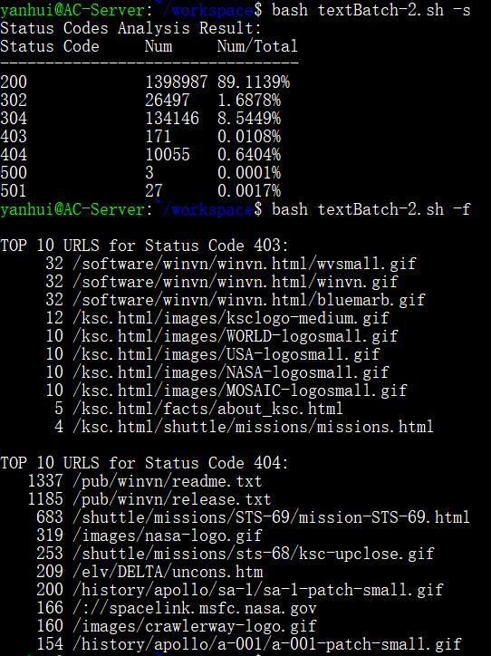
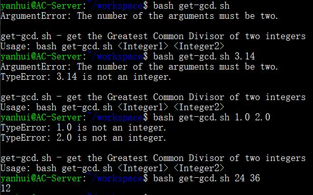

# shell 脚本编程基础

## 实验要求

- [x] 完成课内练习
- [x] 用 bash 编写一个图片批处理脚本
  - [x] 支持命令行参数方式使用不同功能
  - [x] 支持对指定目录下所有支持格式的图片文件进行批处理
    - [x] 支持可选文件夹级联处理
  - [x] 支持以下常见图片批处理功能的单独使用或组合使用
    - [x] 支持对 jpeg 格式图片进行图片质量压缩
    - [x] 支持对 jpeg/png/svg 格式图片在保持原始宽高比的前提下压缩分辨率
    - [x] 支持对图片批量添加自定义文本水印
    - [x] 支持批量重命名（统一添加文件名前缀或后缀，不影响原始文件扩展名）
    - [x] 支持将 png/svg 图片统一转换为 jpg 格式图片
- [x] 用 bash 编写一个文本批处理脚本，对 [2014 世界杯运动员数据](https://c4pr1c3.github.io/LinuxSysAdmin/exp/chap0x04/worldcupplayerinfo.tsv) 附件分别进行批量处理完成相应的数据统计任务
  - [x] 统计不同年龄区间范围（20岁以下、[20-30]、30岁以上）的球员数量、百分比
  - [x] 统计不同场上位置的球员数量、百分比
  - [x] 名字最长的球员是谁？名字最短的球员是谁？
  - [x] 年龄最大的球员是谁？年龄最小的球员是谁？
- [x] 用 bash 编写一个文本批处理脚本，对 [Web 服务器访问日志](https://c4pr1c3.github.io/LinuxSysAdmin/exp/chap0x04/web_log.tsv.7z) 附件分别进行批量处理完成相应的数据统计任务
  - [x] 统计访问来源主机 TOP 100 和分别对应出现的总次数
  - [x] 统计访问来源主机 TOP 100 IP 和分别对应出现的总次数
  - [x] 统计最频繁被访问的 URL TOP 100
  - [x] 统计不同响应状态码的出现次数和对应百分比
  - [x] 分别统计不同4XX状态码对应的 TOP 10 URL 和对应出现的总次数
  - [x] 给定 URL 输出 TOP 100 访问来源主机
- [x] 上述任务的所有源代码文件必须单独提交并提供详细的 –help 脚本内置帮助信息
- [x] 所有统计数据结果要求写入独立实验报告

## 实验环境

### AC-Server

- `GNU bash, version 4.4.20(1)-release`
- 网卡：NAT 网络 + Host-Only
- [已安装增强功能，可挂载共享文件夹](https://github.com/20LinuxManagement/assignment-01-YanhuiJessica/tree/master/assignment-0x03#%E5%A6%82%E4%BD%95%E5%AE%9E%E7%8E%B0%E5%BC%80%E6%9C%BA%E8%87%AA%E5%8A%A8%E6%8C%82%E8%BD%BD-virtualbox-%E7%9A%84%E5%85%B1%E4%BA%AB%E7%9B%AE%E5%BD%95%E5%88%86%E5%8C%BA)

## 图片批处理

### ImageMagick - 命令行下图像处理工具

- 安装：`sudo apt install imagemagick`
- jpeg 格式图片质量压缩：`convert <imgname1.jpg> -quality value <imgname2.jpg>`
- 保持原始宽高比的前提下压缩分辨率：`convert <imgfilename> -resize percentage <imgfilename>`
- 添加自定义文本水印
  ```bash
  convert -fill gray -pointsize 40 -gravity center -font Deng.ttf -draw "text 0,0 '<watermark>'" <in-img> <out-img>

  # -fill：设置字体颜色
  # -pointsize：绘制的点大小/字体大小
  # -gravity：水印位置，可选（NorthWest, North, NorthEast, West, Center, East, SouthWest, South, SouthEast）
  # -font Deng.ttf：添加中文水印需要使用支持中文的字体
  # 0,0：相对偏移量
  ```
- 文件格式转换：`convert <imgname.type1> <imgname.type2>`

### SVG 格式图像压缩分辨率

- ImageMagick 主要处理点阵图（raster image），而 SVG 为矢量图格式
- 比较简单的方法是直接修改 SVG 文件长、宽的值，也可以借助工具 `rsvg-convert` / `inkscape`

#### 参考资料

- [Blank SVGs generated · Issue #1846 · ImageMagick/ImageMagick](https://github.com/ImageMagick/ImageMagick/issues/1846)
- [How can I scale an SVG via command line? - Super User](https://superuser.com/questions/475851/how-can-i-scale-an-svg-via-command-line)

### 文件处理

- 添加文件名前缀或后缀
  ```bash
  mv xxx.jpg head_xxx.jpg
  mv xxx.jpg xxx_tail.jpg
  ```
- 获取文件名指定信息
  ```bash
  file="/mnt/tmp/example.tar.gz"

  echo "${file%/*}/"
  # /mnt/tmp/

  echo "${file##*/}"
  # example.tar.gz

  echo "${$file##*.}"
  # gz
  ```
- 获取文件类型
  ```bash
  file --mime-type filename | grep -P "(?<=/)\S+" -o
  # -P：过滤规则为正则表达式
  # -o：只输出匹配的部分
  ```
- 路径判断（用于条件判断）
  ```bash
  # 判断路径是否存在，且是否为目录
  -d path

  # 判断路径是否存在，且是否为普通文件路径
  -f path
  ```

### 部分处理结果

- 图片添加水印操作前后（中文其实也可以加，但是 Travis 好像过滤掉了……可能没有中文字体？）：<br>

  

  

## 文本批处理

- TSV 文件使用 Tab 分割，使用`cut`选出第`n`列：`cut -f n`
- 主要使用到的工具：cut（列提取）、sort（排序）、grep（过滤）、tr（替换）、uniq（去重与统计）
- 运动员信息统计结果：<br>

- 7z 压缩包解压缩
  ```bash
  # 安装软件包
  sudo apt install p7zip-full

  # 解压
  7z x web_log.tsv.7z
  ```
- 服务器访问日志部分统计结果：<br>


## 课内练习

### 要求

- [x] 求 2 个数的最大公约数
  - 通过命令行参数读取 2 个整数，对不符合参数调用规范（使用小数、字符、少于 2 个参数等）的脚本执行要给出明确错误提示信息，并退出代码执行

### 基本操作

- 求 2 个数的最大公约数可以使用辗转相除法，编写函数
  ```bash
  function gcd {
          local gcd_result
          if [[ $2 == 0 ]];then
                  gcd_result="$1"
                  echo "$gcd_result"
          else
                  gcd_result=$(gcd "$2" "$(($1 % $2))")
                  echo "$gcd_result"
          fi
  }
  ```
- 参数读取后，错误检测与提示
  ```bash
  flag=0  # 记录是否出错
  if [[ $# != 2 ]];then
    echo 'ArgumentError: The number of the arguments must be two.'
    flag=$((flag + 1))
  fi
  re='^[0-9]+$'
  if [[ $1 && ! $1 =~ $re ]];then
    # =~: 正则匹配
    echo "TypeError: $1 is not an integer."
    flag=$((flag + 1))
  fi
  if [[ $2 && ! $2 =~ $re ]];then
    echo "TypeError: $2 is not an integer."
    flag=$((flag + 1))
  fi
  if [[ $flag != 0 ]];then
    echo -e '\nget-gcd.sh - get the Greatest Common Divisor of two integers\nUsage: bash get-gcd.sh <Integer1> <Integer2>' && exit 1
  fi
  ```
- 计算并输出结果
  ```bash
  gcd_result="$(gcd $1 $2)"
  echo $gcd_result
  ```
- 效果展示<br>


## Travis

- Travis 系统默认使用 Ubuntu Xenial 16.04，其中包含图片处理需要使用的`imagemagick`包
  - 使用`apt list --installed`查看已下载包

## 参考资料

- [ImageMagick - Convert, Edit, or Compose Bitmap Images](https://imagemagick.org/index.php)
- [Match specific column with grep command](https://stackoverflow.com/questions/27390292/match-specific-column-with-grep-command)
- [Parameter Expansion](http://mywiki.wooledge.org/BashGuide/Parameters#Parameter_Expansion)
- [SC2207](https://github.com/koalaman/shellcheck/wiki/SC2207)
- [Travis CI User Documentation](https://docs.travis-ci.com/)
- [Bash Functions | Linuxize](https://linuxize.com/post/bash-functions/)
- [How do I test if a variable is a number in Bash?](https://stackoverflow.com/questions/806906/how-do-i-test-if-a-variable-is-a-number-in-bash)