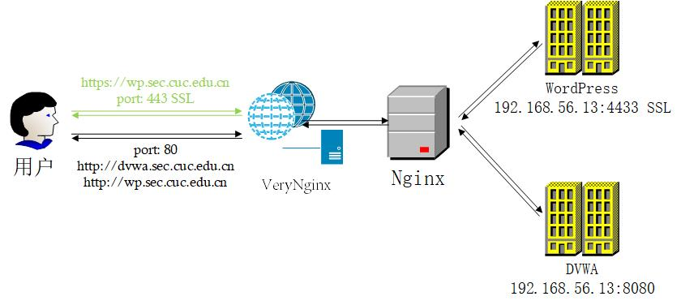
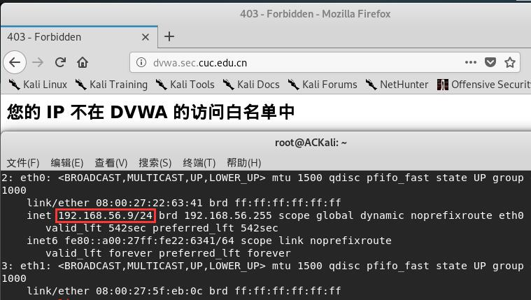
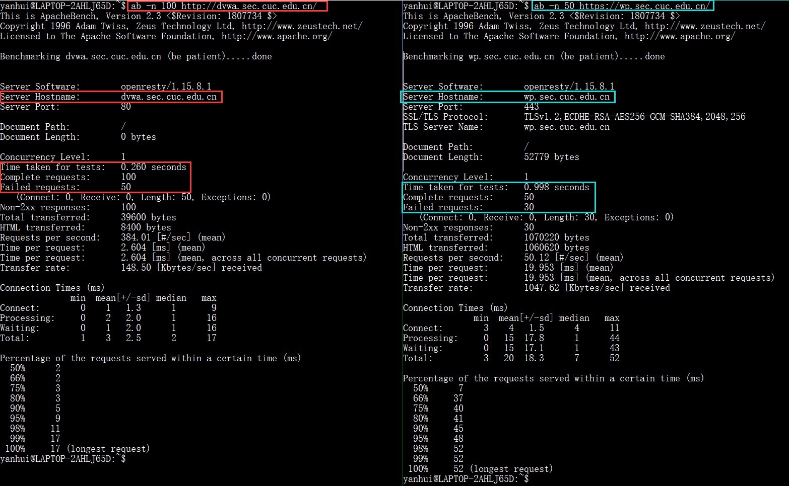

# Web 服务器

## 实验要求

### 基本要求

- [x] 在一台主机（虚拟机）上同时配置 Nginx 和 VeryNginx
  - VeryNginx 作为本次实验的 Web App 的反向代理服务器和 WAF(Web 应用防护系统)
  - PHP-FPM 进程的反向代理配置在 nginx 服务器上，VeryNginx 服务器不直接配置 Web 站点服务
- [x] 使用 [Wordpress](https://wordpress.org/) 搭建的站点对外提供访问的地址为： https://wp.sec.cuc.edu.cn
- [x] 使用 [Damn Vulnerable Web Application (DVWA)](http://www.dvwa.co.uk/) 搭建的站点对外提供访问的地址为：http://dvwa.sec.cuc.edu.cn

### [安全加固要求](#安全加固)

- [x] 使用 IP 地址方式均无法访问上述任意站点，并向访客展示自定义的**友好错误提示信息页面-1**
- [x] Damn Vulnerable Web Application (DVWA) 只允许白名单上的访客来源 IP，其他来源的 IP 访问均向访客展示自定义的**友好错误提示信息页面-2**
- [x] 在不升级 Wordpress 版本的情况下，通过定制 VeryNginx 的访问控制策略规则，热修复 WordPress < 4.7.1 - Username Enumeration
- [x] 通过配置 VeryNginx 的 Filter 规则实现对 Damn Vulnerable Web Application (DVWA) 的 SQL 注入实验在低安全等级条件下进行防护

### [VeryNginx 配置要求](#verynginx-访问配置)

- [x] VeryNginx 的 Web 管理页面仅允许白名单上的访客来源 IP，其他来源的 IP 访问均向访客展示自定义的**友好错误提示信息页面-3**
- [x] 通过定制 VeryNginx 的访问控制策略规则实现：
  - 限制 DVWA 站点的单 IP 访问速率为每秒请求数 < 50
  - 限制 Wordpress 站点的单 IP 访问速率为每秒请求数 < 20
  - 超过访问频率限制的请求直接返回自定义**错误提示信息页面-4**
  - 禁止 curl 访问

## 实验环境

### 宿主机

- Windows 10 专业版
- Host-Only IP：192.168.56.1

### AC-Server

- 网卡：NAT 网络 + Host-Only
- Host-Only IP：192.168.56.13
- 注：实验前应停止`apache2`服务

### AC-Kali

- Host-Only IP：192.168.56.9
- 用于白名单测试

## 用户访问过程



## 实验过程

### 配置本地域名解析

Windows 宿主机编辑`C:\Windows\System32\drivers\etc\hosts`文件，添加域名解析：
```
192.168.56.13 wp.sec.cuc.edu.cn
192.168.56.13 dvwa.sec.cuc.edu.cn
192.168.56.13 vn.sec.cuc.edu.cn
```
注：如果没有预期结果，注意查看系统代理（~~比如科学上网工具~~）

### 安装 Nginx、VeryNginx、PHP 组件

- 安装 Nginx：`sudo apt update && sudo apt install nginx`（配置文件路径：`/etc/nginx/nginx.conf`）
- 安装 VeryNginx（配置文件路径：`/opt/verynginx/openresty/nginx/conf/nginx.conf`）
  ```bash
  git clone https://github.com/alexazhou/VeryNginx.git
  cd VeryNginx/

  # 安装依赖
  sudo apt install libssl-dev libpcre3 libpcre3-dev build-essential
  sudo apt install zlibc zlib1g zlib1g-dev

  sudo python3 install.py install

  # 创建用户 nginx，否则修改配置文件
  sudo adduser nginx

  # 保存配置时需要权限
  sudo chmod -R 777 /opt/verynginx/verynginx/configs
  ```
- PHP 组件安装：`sudo apt install php-fpm php-mysql`

#### Trouble Shooting

- [zlib library not found](https://github.com/kgretzky/evilginx/issues/38)

### WordPress

- 创建一个数据库和一个用户
  ```bash
  sudo apt install mysql-server

  # 连接数据库，默认无密码
  sudo mysql -u root -p

  # 创建数据库
  CREATE DATABASE wordpress DEFAULT CHARACTER SET utf8mb4 COLLATE utf8mb4_general_ci;

  # 创建用户并赋予对应数据库权限
  CREATE USER wordpress@localhost IDENTIFIED BY 'password';
  GRANT ALL ON wordpress.* TO wordpress@localhost;
  ```
- 安装 WordPress
  ```bash
  wget https://wordpress.org/wordpress-4.7.tar.gz
  tar -xzvf wordpress-4.7.tar.gz
  cd wordpress/
  ```
- 创建`wp-config.php`
  ```bash
  # 拷贝一份配置文件
  cp wp-config-sample.php wp-config.php
  ```
- 编辑`wp-config.php`文件
  - 修改数据库信息<br>

  - 添加 Security Keys
    ```bash
    # 通过在线生成器获得
    curl https://api.wordpress.org/secret-key/1.1/salt/
    vi wp-config.php
    # 在以下标签处粘贴
    #  * Authentication Unique Keys and Salts.
    ```
- 移动至站点根目录：`sudo cp wordpress/. /var/www/html/wordpress -r`
- 站点配置
  ```bash
  sudo cp /etc/nginx/sites-available/default /etc/nginx/sites-available/wp
  sudo vi /etc/nginx/sites-available/wp
  ```

  

  ```bash
  # 建立软链接
  sudo ln -s /etc/nginx/sites-available/wp /etc/nginx/sites-enabled/wp

  # 重新加载配置文件
  sudo nginx -s reload
  ```
- 访问`http://wp.sec.cuc.edu.cn/wp-admin/install.php`以运行安装脚本

#### 自签证书

```bash
# Change to root
sudo su

# A directory to store all keys and certificates
mkdir /root/ca
cd /root/ca
mkdir certs crl newcerts private
chmod 700 private
touch index.txt
echo 1000 > serial

# Copy the root CA configuration file from the https://jamielinux.com/docs/openssl-certificate-authority/appendix/root-configuration-file.html to /root/ca/openssl.cnf
vi /root/ca/openssl.cnf

# Create the root key
openssl genrsa -aes256 -out private/ca.key.pem 4096
chmod 400 private/ca.key.pem

# Create the root certificate
openssl req -config openssl.cnf \
      -key private/ca.key.pem \
      -new -x509 -days 7300 -sha256 -extensions v3_ca \
      -out certs/ca.cert.pem
# CN
# Beijing
# Chaoyang
# Communication University of China
# Cyber Security
# WP Root CA

# A directory to store the intermediate CA files
mkdir /root/ca/intermediate
cd /root/ca/intermediate
mkdir certs crl csr newcerts private
chmod 700 private
touch index.txt
echo 1000 > serial

# crlnumber is used to keep track of certificate revocation lists
echo 1000 > /root/ca/intermediate/crlnumber

# Copy the intermediate CA configuration file from the https://jamielinux.com/docs/openssl-certificate-authority/appendix/intermediate-configuration-file.html to /root/ca/intermediate/openssl.cnf
vi /root/ca/intermediate/openssl.cnf

# Create the intermediate key
cd ..
openssl genrsa -aes256 \
      -out intermediate/private/intermediate.key.pem 4096
chmod 400 intermediate/private/intermediate.key.pem

# Create the intermediate certificate
openssl req -config intermediate/openssl.cnf -new -sha256 \
      -key intermediate/private/intermediate.key.pem \
      -out intermediate/csr/intermediate.csr.pem
# CN
# Beijing
# Chaoyang
# Communication University of China
# Cyber Security
# WP Intermdediate CA

# Sign the certificate
openssl ca -config openssl.cnf -extensions v3_intermediate_ca \
      -days 3650 -notext -md sha256 \
      -in intermediate/csr/intermediate.csr.pem \
      -out intermediate/certs/intermediate.cert.pem
chmod 444 intermediate/certs/intermediate.cert.pem

# Create the certificate chain file
cat intermediate/certs/intermediate.cert.pem \
      certs/ca.cert.pem > intermediate/certs/ca-chain.cert.pem
chmod 444 intermediate/certs/ca-chain.cert.pem

# Sign server and client certificates
openssl genrsa -aes256 \
      -out intermediate/private/sec.cuc.edu.cn.key.pem 2048
chmod 400 intermediate/private/sec.cuc.edu.cn.key.pem
openssl req -config intermediate/openssl.cnf \
      -key intermediate/private/sec.cuc.edu.cn.key.pem \
      -new -sha256 -out intermediate/csr/sec.cuc.edu.cn.csr.pem
# CN
# Beijing
# Chaoyang
# Communication University of China
# Cyber Security
# sec.cuc.edu.cn
openssl ca -config intermediate/openssl.cnf \
      -extensions server_cert -days 375 -notext -md sha256 \
      -in intermediate/csr/sec.cuc.edu.cn.csr.pem \
      -out intermediate/certs/sec.cuc.edu.cn.cert.pem
chmod 444 intermediate/certs/sec.cuc.edu.cn.cert.pem

openssl rsa -in intermediate/private/sec.cuc.edu.cn.key.pem -out intermediate/private/sec.cuc.edu.cn.key.nopass.pem
cat intermediate/certs/sec.cuc.edu.cn.cert.pem intermediate/certs/ca-chain.cert.pem > intermediate/certs/sec.cuc.edu.cn.chained.cert.pem

cp intermediate/certs/sec.cuc.edu.cn.chained.cert.pem /etc/ssl/certs/nginx-selfsigned.crt
cp intermediate/private/sec.cuc.edu.cn.key.nopass.pem /etc/ssl/private/nginx-selfsigned.key

# 退出 root 用户
exit

vi /etc/nginx/snippets/self-signed.conf
# 添加内容如下
# ssl_certificate /etc/ssl/certs/nginx-selfsigned.crt;
# ssl_certificate_key /etc/ssl/private/nginx-selfsigned.key;

sudo vi /etc/nginx/sites-available/wp
```

```bash
sudo nginx -s reload
```

#### 将根证书添加至受信任列表

```bash
# 虚拟机内
sudo cp /root/ca/certs/ca.cert.pem /home/yanhui

# 宿主机 WSL
scp 192.168.56.13:/home/yanhui/ca.cert.pem .

# 宿主机管理员 CMD
certutil -addstore -f "ROOT" ca.cert.pem

# Firefox 证书系统独立，需要在 选项 -> 隐私与安全 -> 证书 单独导入
```


#### VeryNginx 监听 443 端口

编辑`/opt/verynginx/openresty/nginx/conf/nginx.conf`，添加：
```bash
server {
      listen 443 ssl;
      include /etc/nginx/snippets/self-signed.conf;
      include /opt/verynginx/verynginx/nginx_conf/in_server_block.conf;

      location = / {
          root   html;
          index  index.html index.htm;
      }
  }
```

#### 参考指南

- [How to install WordPress](https://wordpress.org/support/article/how-to-install-wordpress)
- [How to Configure Nginx to Execute PHP Using PHP-FPM](https://www.thegeekstuff.com/2013/12/nginx-php-fpm/)
- [How To Create a Self-Signed SSL Certificate for Nginx in Ubuntu 18.04](https://www.digitalocean.com/community/tutorials/how-to-create-a-self-signed-ssl-certificate-for-nginx-in-ubuntu-18-04)
- [OpenSSL Certificate Authority](https://jamielinux.com/docs/openssl-certificate-authority/index.html)
- [Configuring HTTPS servers](http://nginx.org/en/docs/http/configuring_https_servers.html)

### DVWA

```bash
sudo apt install php-gd

cd /var/www/html
sudo git clone https://github.com/ethicalhack3r/DVWA
cd DVWA/
sudo cp config/config.inc.php.dist config/config.inc.php

sudo vi config/config.inc.php
# Change db_user from root to dvwa
# Generated $_DVWA[ 'recaptcha_public_key' ] & $_DVWA[ 'recaptcha_private_key' ]
# from https://www.google.com/recaptcha/admin/create

# Mysql config
sudo mysql -u root -p
create user dvwa@localhost identified by 'p@ssw0rd';
create database dvwa;
grant all on dvwa.* to dvwa@localhost;

# Needs to be writable by the web service
sudo chmod 777 hackable/uploads/
sudo chmod 777 external/phpids/0.6/lib/IDS/tmp/phpids_log.txt
sudo chmod 777 config/

sudo vi /etc/php/7.2/fpm/php.ini
# allow_url_include = Off -> On

sudo systemctl reload php7.2-fpm.service

sudo cp /etc/nginx/sites-available/default /etc/nginx/sites-available/dvwa
sudo vi /etc/nginx/sites-available/dvwa
# 内容与先前 WordPress 的配置相似
# 监听 8080 端口

sudo ln -s /etc/nginx/sites-available/dvwa /etc/nginx/sites-enabled/dvwa
sudo nginx -s reload
```


#### 参考指南

- [ethicalhack3r/DVWA](https://github.com/ethicalhack3r/DVWA)

### VeryNginx 配置反向代理

- 在启动 VeryNginx 前关闭 Nginx：`sudo nginx -s quit`/`sudo kill -s quit PID`
- 启动 VeryNginx：`sudo /opt/verynginx/openresty/nginx/sbin/nginx`
- 访问管理面板 http://vn.sec.cuc.edu.cn/verynginx/index.html ，登录用户名和密码为 `verynginx` / `verynginx`

#### 配置详情

<br>
<br>


#### 强制 HTTPS 效果

~~假装是 HSTS~~


### 安全加固

#### 使用 IP 地址方式均无法访问上述任意站点，并向访客展示自定义的友好错误提示信息页面-1

- Request Matcher<br>

- 自定义的友好错误提示信息页面-1<br>

- Filter<br>

- 仅对 VeryNginx 监听的 80 和 443 端口有效(╮ŏωŏ)╭<br>


#### Damn Vulnerable Web Application (DVWA) 只允许白名单上的访客来源 IP，其他来源的 IP 访问均向访客展示自定义的友好错误提示信息页面-2

- Request Matcher<br>

- 自定义的友好错误提示信息页面-2<br>

- Filter<br>

- 效果展示<br>
<br>


#### 在不升级 Wordpress 版本的情况下，通过定制 VeryNginx 的访问控制策略规则，热修复 WordPress < 4.7.1 - Username Enumeration

- 如果不能复现而被 **404** 警告
  - 修改 Permalinks，只要不是默认的 Plain 就可以<br>
  
  - 修改`/etc/nginx/sites-available/wp`，最后`sudo nginx -s reload`
    ```bash
    location / {
      # 原：try_files $uri $uri/ =404;
      try_files $uri $uri/ /index.php?$args;
    }
    ```
  - 参考：[404 when using pretty permalinks on new WordPress site on LEMP/nginx](https://www.digitalocean.com/community/questions/404-when-using-pretty-permalinks-on-new-wordpress-site-on-lemp-nginx)
- 未修复前可以访问`https://wp.sec.cuc.edu.cn/wp-json/wp/v2/users/`并获得用户信息<br>

  

- Request Matcher<br>

- Response<br>

- Filter<br>

- 修复后<br>


#### 通过配置 VeryNginx 的 Filter 规则实现对 Damn Vulnerable Web Application (DVWA) 的 SQL 注入实验在低安全等级条件下进行防护

- 将 DVWA 的安全级别调整为 Low<br>

- 防护前<br>

  

- Request Matcher<br>

- Filter<br>

- 效果展示<br>


### VeryNginx 访问配置

#### VeryNginx 的 Web 管理页面仅允许白名单上的访客来源 IP，其他来源的 IP 访问均向访客展示自定义的友好错误提示信息页面-3

- Request Matcher<br>

- 自定义的友好错误提示信息页面-3<br>

- Filter<br>

- 效果展示<br>
<br>


#### 定制 VeryNginx 的访问控制策略规则

- Frequency Limit<br>

- 自定义的友好错误提示信息页面-4<br>

- 安装压力测试工具：`sudo apt install apache2-utils`
- 压测结果<br>

- 压力测试同时访问网站，会得到错误信息<br>

- 通过设置 Browser Verify 来禁止`curl`获取页面信息<br>

- 由于`curl`不支持 302 重定向，故无法继续访问<br>


## 参考资料

- [nginx documentation](http://nginx.org/en/docs/)
- [VeryNginx](https://github.com/alexazhou/VeryNginx/blob/master/readme_zh.md)