# Shell 脚本编程进阶 - FTP、NFS、DHCP、DNS、Samba 服务器的自动安装与自动配置

## 实验要求

### 软件环境

- [x] 选择合适的 FTP 服务器软件支持所有任务要求 - proftpd
  - [x] 配置一个提供匿名访问的 FTP 服务器，匿名访问者可以访问 1 个目录且仅拥有该目录及其所有子目录的只读访问权限
  - [x] 配置一个支持用户名和密码方式访问的账号，该账号继承匿名访问者所有权限，且拥有对另 1 个独立目录及其子目录完整读写（包括创建目录、修改文件、删除文件等）权限
    - [x] 该账号仅可用于FTP服务访问，不能用于系统shell登录
  - [x] FTP 用户不能越权访问指定目录之外的任意其他目录和文件
  - [x] 匿名访问权限仅限白名单IP来源用户访问，禁止白名单IP以外的访问
    - 注：vsftpd 目前没有找到合适的解决方案
  - [ ] （可选）使用 FTPS 服务代替 FTP 服务，上述所有要求在 FTPS 服务中同时得到满足
- [x] NFS 服务器配置
  - [x] 在 1 台 Linux 上配置 NFS 服务，另 1 台电脑上配置 NFS 客户端挂载 2 个权限不同的共享目录，分别对应只读访问和读写访问权限
  - [ ] （可选）在客户端或NFS服务器上抓包分析使用NFS协议时的远程文件下载、上传、移动、删除等操作是否是明文？远程的文件传输数据流是否可以被恢复出完整的传输文件？
- [x] 2 台虚拟机使用 Internal 网络模式连接，其中一台虚拟机上配置 DHCP 服务，另一台服务器作为 DHCP 客户端，从该 DHCP 服务器获取网络地址配置
- [x] 安装和配置 Samba 独立共享服务器
  - [x] Linux 设置匿名访问共享目录
  - [x] Linux 设置用户名密码方式的共享目录
- [x] Samba 服务器配置和客户端配置连接测试
  - [x] Linux 访问 Windows 的匿名共享目录
  - [x] Linux 访问 Windows 的用户名密码方式共享目录
  - [x] 下载整个目录
- [x] DNS
  - [x] 基于上述 Internal 网络模式连接的虚拟机实验环境，在 DHCP 服务器上配置 DNS 服务，使得另一台作为 DNS 客户端的主机可以通过该 DNS 服务器进行 DNS 查询
  - [x] 在 DNS 服务器上添加`zone "cuc.edu.cn"`的解析记录

### Shell 脚本编程基本要求

- [x] 假设目标系统没有配置过 root 用户免密登录，要求在自动安装脚本中包含自动配置远程 root 用户免密登录的代码
- [x] 目标环境相关参数应使用独立的配置文件或配置脚本（在主调脚本中引用配置脚本）

## 实验环境

### 宿主机 - LAPTOP-2AHLJ65D

Host-Only IP：192.168.56.1

### 工作主机 - AC-Server

- 网卡配置：NAT 网络、Host-Only、内部网络（intnet）<br>
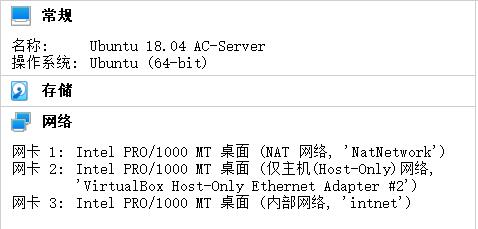
- Host-Only IP：192.168.56.13

### 目标主机 - AC-Target

- 网卡配置：NAT 网络、Host-Only、内部网络（intnet）<br>
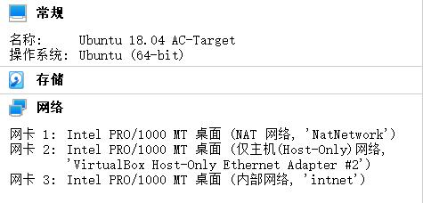
- Host-Only IP: 192.168.56.21
- [网络配置参考](https://github.com/20LinuxManagement/assignment-01-YanhuiJessica/tree/master/assignment-0x01#%E7%BD%91%E7%BB%9C%E9%85%8D%E7%BD%AE)

## 实验过程

### 自动构建

- 主调脚本：[build.sh](autobuild/build.sh)
- 运行：`bash autobuild/build.sh`

#### 完整过程（含部分搭建后的测试）

<a href="https://asciinema.org/a/IYHDP2rRIdsOH3VhZdipUUxy9" target="_blank"></a>

### 自动配置 SSH 免密登录

- 需要先在 AC-Target 使用`sudo passwd`设置 root 用户的密码
- 修改 AC-Target 的`/etc/ssh/sshd_config`
  ```bash
  # 设置可通过口令认证 SSH
  PasswordAuthentication yes
  # 允许 root 用户登录
  PermitRootLogin yes
  ```
- 余下配置由 [nopassh.sh](autobuild/code/nopassh.sh) 完成

### FTP

- `code`文件夹下包含 vsftpd 的自动配置脚本 [vsftpd.sh](autobuild/code/vsftpd.sh)，但由于 vsftpd 无法针对特定用户进行 IP 地址过滤，因此不做进一步考虑
- 不能越权访问重点在于如何指定根目录
- 配置脚本：[proftpd.sh](autobuild/code/proftpd.sh) / 配置文件：[proftpd.conf](autobuild/config/proftpd.conf)

#### 匿名访问目录

- 匿名访问者可以访问 1 个目录且仅拥有该目录及其所有子目录的只读访问权限<br>
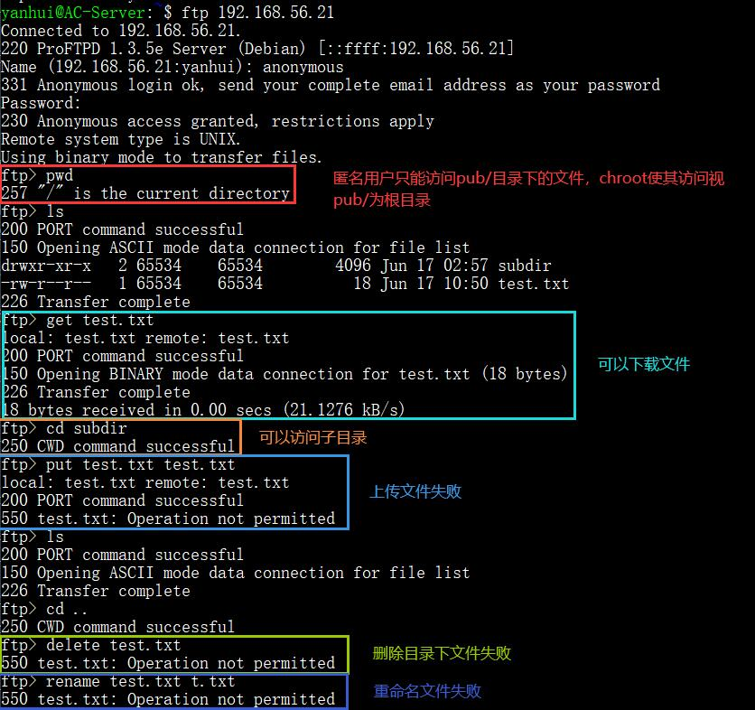
- 无法使用匿名用户账户名登录，只能使用别名`anonymous`<br>
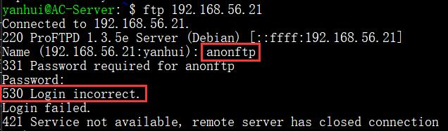
- 宿主机不在白名单内，无法使用匿名账户<br>
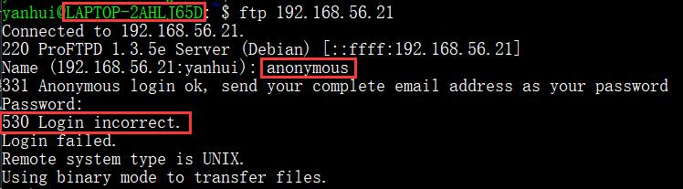

#### 虚拟用户

- 继承匿名访问者所有权限，且拥有对另 1 个独立目录及其子目录完整读写权限<br>
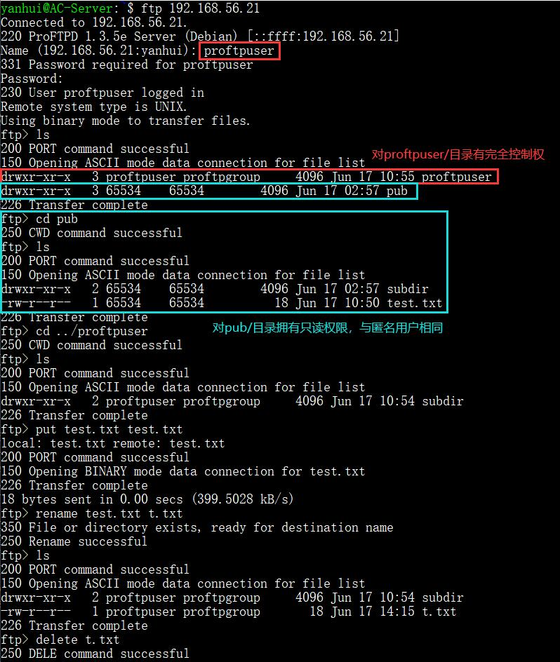
- 虚拟用户仅作为 proftpd 用户使用，shell 中无法使用<br>
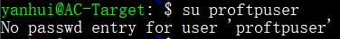

#### 参考资料

- [vsftpd - Community Help Wiki](https://help.ubuntu.com/community/vsftpd)
- [vsftpd.conf(5) - Linux man page](https://linux.die.net/man/5/vsftpd.conf)
- [How To Set Up vsftpd for Anonymous Downloads on Ubuntu 16.04](https://www.digitalocean.com/community/tutorials/how-to-set-up-vsftpd-for-anonymous-downloads-on-ubuntu-16-04)
- [vsftpd : limit connection to a set of IP addresses](https://serverfault.com/questions/577393/vsftpd-limit-connection-to-a-set-of-ip-addresses)
- [ProFTPD](http://www.proftpd.org/)
- [How to Set Up Anonymous FTP with ProFTP](https://delightlylinux.wordpress.com/2017/06/10/how-to-set-up-anonymous-ftp-with-proftp/)
- [htaccess “order” Deny, Allow, Deny](https://stackoverflow.com/questions/9943042/htaccess-order-deny-allow-deny)
- [Configuring ProFTPd with virtual users in a file](https://ixnfo.com/en/configuring-proftpd-with-virtual-users-in-a-file.html#comments)
- [ProFTPd, MySQL, virtual users and permissions](https://serverfault.com/questions/325913/proftpd-mysql-virtual-users-and-permissions)

### NFS

- 只读目录和读写目录及其子目录，显示的属主、权限信息相同<br>
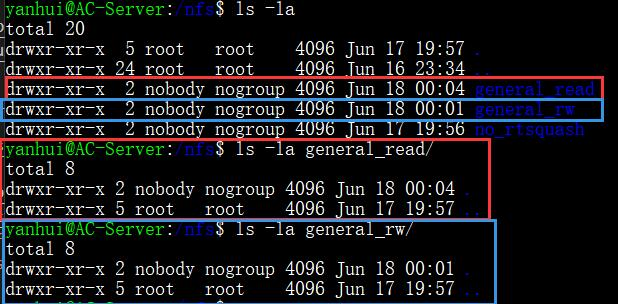
- 只读目录无法创建文件<br>
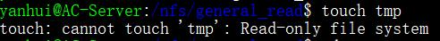
- 在客户端，读写目录只能以 root 用户权限创建目录和文件，创建后属主为`nobody:nogroup`<br>
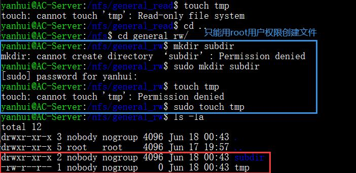
- 在服务器端查看共享目录中文件、子目录的属主、权限信息与客户端一致<br>
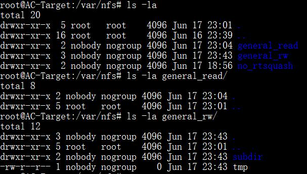
- 默认情况下，NFS 会将远程 root 用户转换为服务器端的普通用户，以防止客户端的 root 用户将服务器文件系统作为根目录，`no_root_squash`选项会禁用这一特性，这样客户端创建文件的属主就是 root<br>
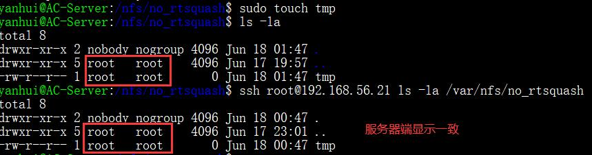

#### 参考资料

- [How To Set Up an NFS Mount on Ubuntu 18.04](https://www.digitalocean.com/community/tutorials/how-to-set-up-an-nfs-mount-on-ubuntu-18-04)

### DHCP

- 自动配置前<br>
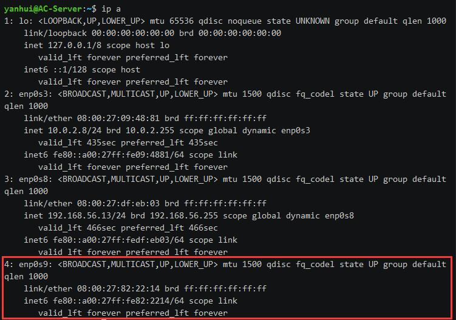
- 自动配置结束后<br>
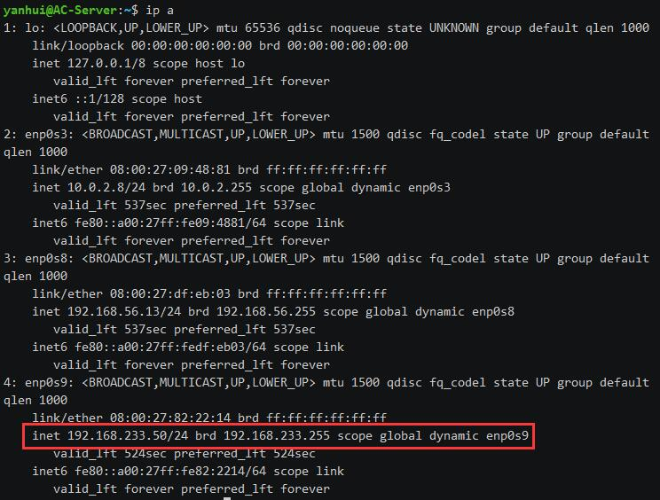

#### 参考资料

- [isc-dhcp-server](https://help.ubuntu.com/community/isc-dhcp-server)

### DNS

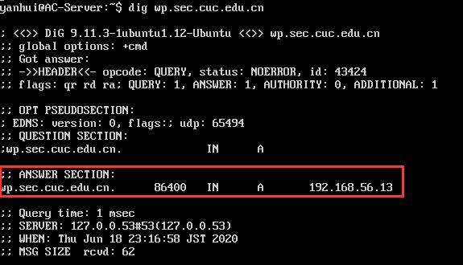

#### 参考资料

- [BIND9ServerHowto](https://help.ubuntu.com/community/BIND9ServerHowto)
- [Configure BIND as DNS Server on Ubuntu 18.04](https://kifarunix.com/configure-bind-as-dns-server-on-ubuntu-18-04/)
- [BIND 9 Administrator Reference Manual](https://bind9.readthedocs.io/en/latest/index.html)

### Samba

#### Windows -> Linux

- Windows 启用分享，允许网络发现、文件和打印机共享<br>
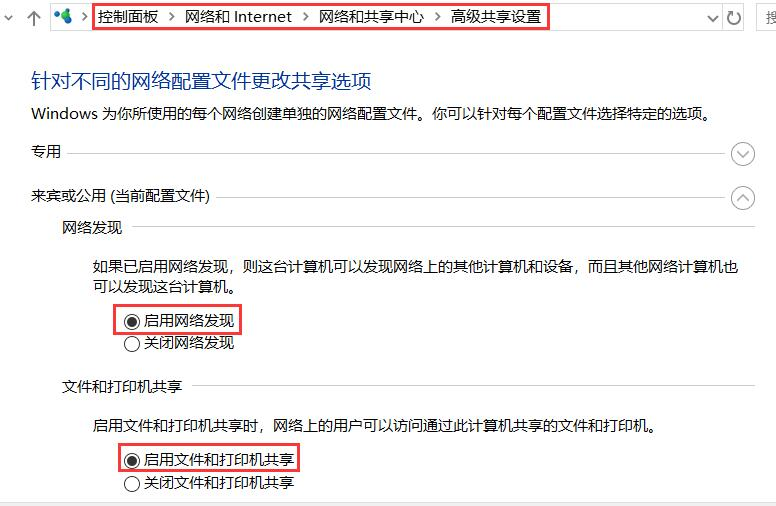
  - 要实现匿名用户访问需要关闭「密码保护共享」<br>
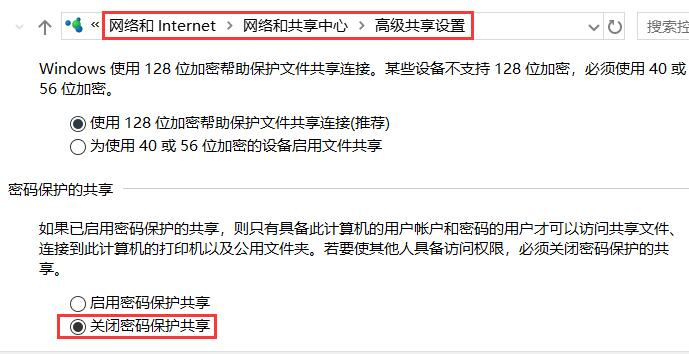
- 管理员命令提示符
  ```bash
  # 创建 Samba 用户
  net user smbUser /add

  # 设置密码为 smbpass
  net user smbUser smbpass

  # smbUser 自动添加至 Users 用户组
  # 如未添加可通过以下命令完成
  net localgroup Users smbUser /add
  ```
- 创建匿名共享目录 public，设置文件属性<br>
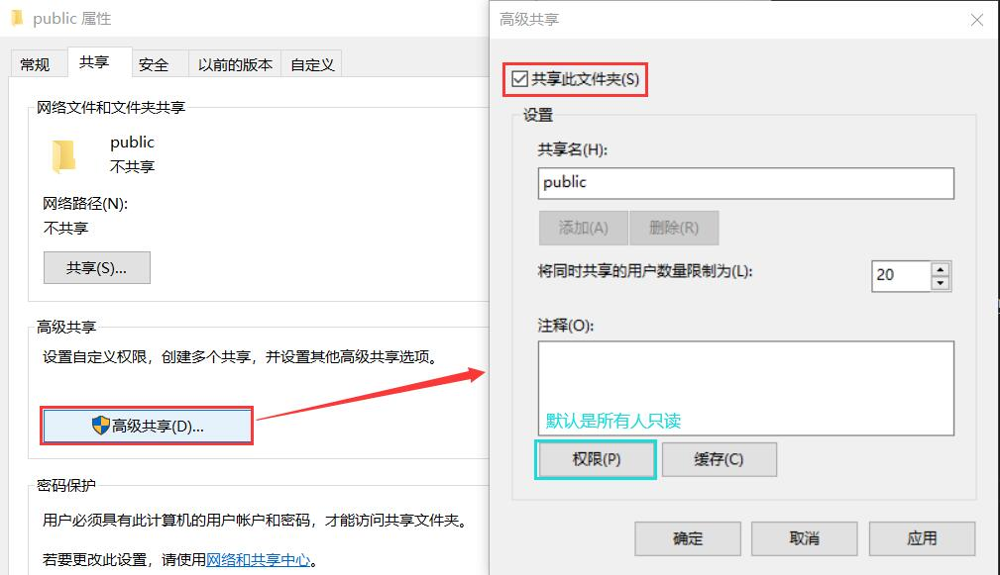
  - 文件安全与文件共享的用户权限设置应相同，否则权限以较严格的为准
  - 添加 Everyone<br>
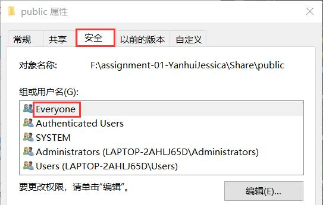
- 创建以用户名密码方式访问的共享目录，设置文件属性<br>
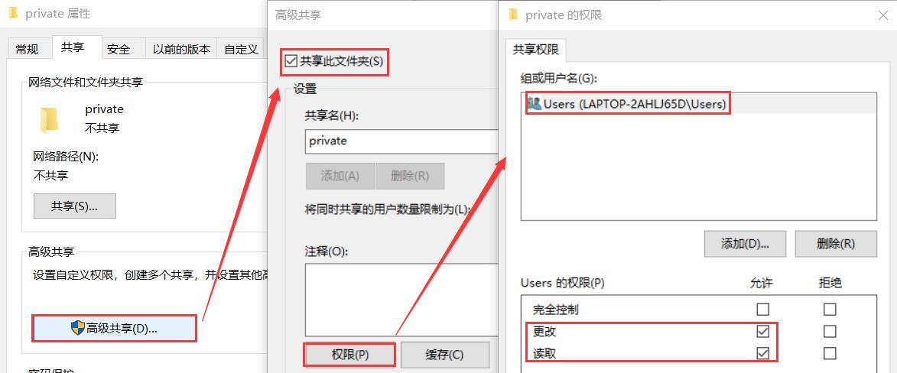
  - 对文件的权限也要进行相应的修改<br>
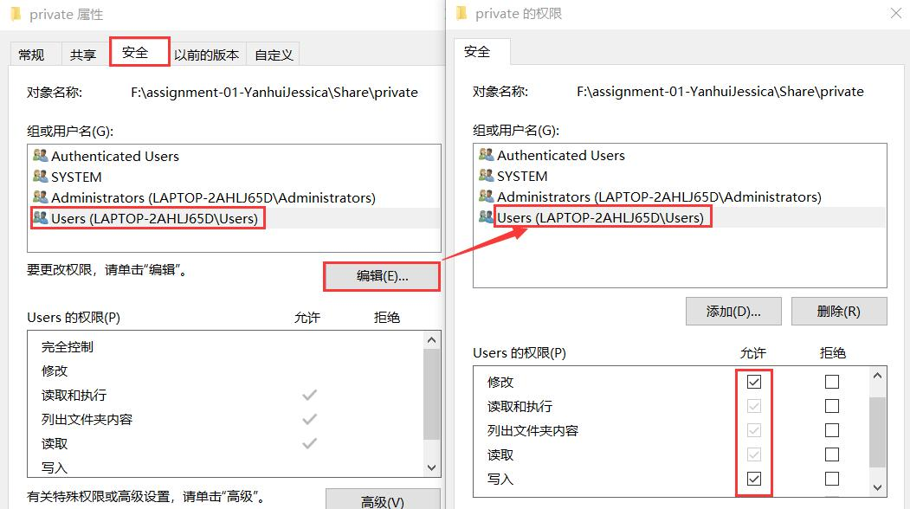
- Linux 访问需要安装`smbclient`：`sudo apt install smbclient`
- 列出宿主机上的可用共享（可以不用输入密码）：`smbclient -L LAPTOP-2AHLJ65D`
- 匿名用户和普通用户对匿名共享目录和用户名密码方式访问的共享目录的访问情况<br>
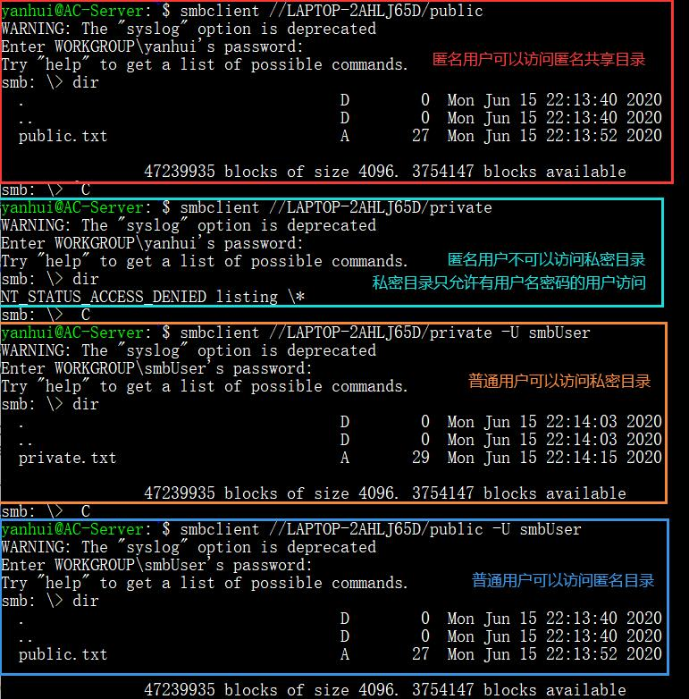
- 下载整个目录
  ```bash
  # 递归下载
  recurse on
  # 关闭询问 -> 全部同意下载
  prompt off
  # 下载
  mget *
  ```
  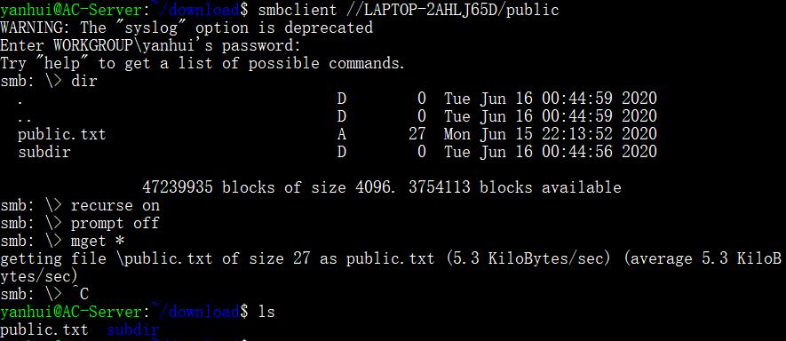

#### Linux -> Windows

- Linux 由 [samba-server.sh](autobuild/code/samba-server.sh) 自动构建分享目录
- Windows 上右键 -> 新建快捷方式，输入`\\192.168.56.21\pub-share`即可挂载匿名用户目录，用户名密码方式共享目录同理：`\\192.168.56.21\private-share`

#### Trouble-Shooting

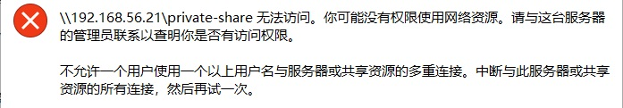

- 最简单的方法是删除之前挂载的目录
- 打开 cmd（管理员命令行输入`net use`可能返回列表为空），输入`net use /delete \\192.168.56.21\pub-share`即可删除

#### 推荐工具

- [CHMOD Calculator](https://chmodcommand.com/)

#### 参考资料

- [smb.conf — The configuration file for the Samba suite](https://www.samba.org/~ab/output/htmldocs/manpages-3/smb.conf.5.html#PRINTABLE)
- [Install and Configure Samba | Ubuntu](https://ubuntu.com/tutorials/install-and-configure-samba#1-overview)
- [How to Share Files Between Windows and Linux](https://www.howtogeek.com/176471/how-to-share-files-between-windows-and-linux/)
- [smbclient](https://www.samba.org/samba/docs/current/man-html/smbclient.1.html)
- [Windows: Fix ‘Multiple connections to a server or shared resource by the same user’ Error](https://www.technipages.com/fix-multiple-connections-to-a-server-or-shared-resource-by-the-same-user-error)
